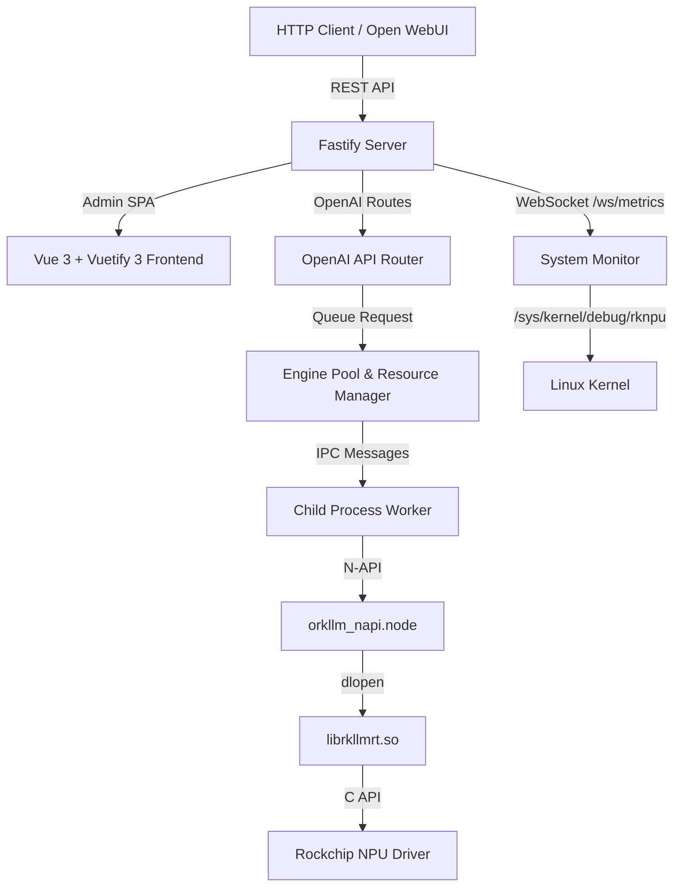

# oRKLLM — Agent Instructions & Architecture

oRKLLM is an OpenAI API-compatible local LLM inference server and admin application designed for Rockchip NPU-powered platforms (specifically the **RK3576** found in the NanoPi M5 and **RK3588** series).

This project draws architectural inspiration from [oMLX](https://github.com/jundot/omlx) (optimized for Apple Silicon / MLX) but adaptively re-engineered to run on the Rockchip RKLLM runtime (`librkllmrt.so`) with its unique hardware constraints.

---

## 1. Executive Summary & Design Goals

The main objective of **oRKLLM** is to turn low-power Rockchip SBCs (Single Board Computers) into high-performance, self-hosted, private AI endpoints.

### Core Goals:
1. **OpenAI API Compatibility**: Expose standard `/v1/chat/completions`, `/v1/completions`, and `/v1/embeddings` endpoints.
2. **Beautiful Admin Dashboard**: A premium, responsive web console for monitoring NPU/CPU/RAM/Temp utilization, configuring settings, loading/unloading models, and testing inference in real-time.
3. **Optimized NPU Resource Management**: Safely serialize inference calls and manage model swaps (swap-in/swap-out) within NPU memory constraints.
4. **Zero-Inference Dependencies**: Run in-process on the target board (like the NanoPi M5) without needing cloud connectivity, heavy external deep learning runtimes (e.g., PyTorch), or complex compilation toolchains.

---

## 1a. Development Philosophy

oRKLLM is a **Node.js / JavaScript project end-to-end**. All tooling decisions should reflect that.

### Language preference

- **Always prefer Node.js / JavaScript** for scripting, data processing, CI steps, test helpers, and one-off utilities.
- Use `node -e "..."` or inline `node << 'EOF' ... EOF` in shell scripts and CI workflows.
- **Never default to Python** unless it is the only viable option (e.g. `rkllm-toolkit` model conversion, which is a Python-only SDK). If you reach for `python3`, stop and ask whether Node.js can do it instead.

Examples of what this means in practice:

| Task | ✅ Correct | ❌ Avoid |
| :--- | :--- | :--- |
| Parse JSON in CI | `node -e "const d=JSON.parse(...)"` | `python3 -c "import json..."` |
| HTTP request in CI | `node -e "require('https').request(...)"` | `python3 -c "import urllib..."` |
| File processing | Node.js script in `scripts/` | ad-hoc Python script |
| Test helpers | `.mjs` file, imported by Playwright | Python subprocess |
| Data munging | `jq` for simple cases, Node.js for complex | Python |

### Toolchain

- **Runtime**: Node.js (backend, scripts, CI inline code)
- **Frontend**: Vue 3 + Vuetify 3, built with Vite
- **Tests**: Playwright (E2E), no unit test framework currently
- **CI scripting**: Bash + `node -e` / `node << 'EOF'`, never Python
- **Exception**: `rkllm-toolkit` model conversion on the build host (10.3.0.241) requires Python — that is the only sanctioned Python use

---

## 2. Implemented Stack

The project was re-engineered from a Python/FastAPI concept to a fully Node.js stack:

| Layer | Technology |
| :--- | :--- |
| **API Server** | Node.js + Fastify |
| **Native Bindings** | C++ N-API addon (`node-addon-api`) with `dlopen`/`dlsym` for `librkllmrt.so` |
| **Mock Fallback** | Pure JS mock engine (auto-enabled on non-ARM/non-Linux platforms) |
| **Frontend** | Vue 3 + Vuetify 3 SPA, built with Vite, served statically by Fastify |
| **Database** | SQLite via `node:sqlite` (Node ≥22.5) or `better-sqlite3` fallback (Node 20) |
| **E2E Tests** | Playwright |

---

## 3. Hardware & Runtime Constraints of RK3576 (NanoPi M5)

The **NanoPi M5** is powered by the Rockchip **RK3576** SoC:

- **Performance**: 6 TOPS (INT8) NPU.
- **Model Format**: Models must be converted on an **x86 Linux PC** using `rkllm-toolkit` to `.rkllm` format.
- **Quantization**: Must use 4-bit (`w4a16`) or 8-bit (`w8a8`).
- **Active Model Constraint**: Only **one model** can be loaded in NPU memory at a time.
- **Serial Execution**: `rkllm_run` must be called serially. All inference is serialized via a dedicated queue.

---

## 4. Architecture



### Key Components

| File | Role |
| :--- | :--- |
| `src/addon/orkllm_napi.cpp` | C++ N-API addon; wraps `rkllm_init`, `rkllm_run`, `rkllm_destroy` with `Napi::ThreadSafeFunction` for non-blocking callbacks |
| `src/worker.js` | Process-isolated inference worker; receives `load`/`run`/`unload` IPC commands from pool |
| `src/pool.js` | Single-active-model lock, auto-swap, idle timeout (configured via SQLite settings) |
| `src/monitor.js` | Polls CPU, RAM, SoC Temp, NPU load; Rockchip-native on ARM64 Linux, simulated elsewhere |
| `src/stats.js` | Records prefill/generation tokens and latencies in SQLite |
| `src/db.js` | SQLite + PRAGMA user_version migration runner; 2 versioned migrations; all table accessors |
| `src/config.js` | Env-driven settings; multi-user credential helpers; PBKDF2-HMAC-SHA256 |
| `src/cache.js` | Tiered SSD prefix KV cache (hot/cold LRU), sliding context window trim |
| `src/server.js` | Fastify bootstrap; trustProxy config; mounts `/ws/metrics`, `/ws/logs`, static SPA, API routes |
| `src/api/routes.js` | `/v1/chat/completions` (SSE streaming + prefix cache), `/v1/models`, `/v1/embeddings` |
| `src/admin/routes.js` | Auth (local + OIDC + SAML), user CRUD, RBAC, HF proxy, audit log, settings (incl. trustedProxy) |
| `src/auth/routes.js` | OIDC (PKCE + confidential) and SAML 2.0 routes at `/auth/*` |
| `src/auth/session.js` | Shared signCookie / verifyCookie / issueSessionCookie (userId\|username\|role\|expires\|HMAC) |
| `src/mock_engine.js` | JS mock engine streaming realistic fake tokens (for macOS dev) |
| `frontend/src/components/AppNav.vue` | Shared navbar; Site Management item for admins; provider chip |
| `frontend/src/views/Dashboard.vue` | Serving stats, hardware telemetry, inference playground |
| `frontend/src/views/Models.vue` | Model manager + HF search/collection browser/downloader |
| `frontend/src/views/Settings.vue` | Global settings, HF token, prefix cache config, trusted proxy |
| `frontend/src/views/Logs.vue` | Full-page live log terminal (WebSocket) |
| `frontend/src/views/Bench.vue` | Inference benchmark (TTFT, tok/s) |
| `frontend/src/views/Chat.vue` | Full streaming chat against OpenAI-compatible API |
| `frontend/src/views/SiteManagement.vue` | Admin-only: user CRUD, OIDC/SAML config, audit log |
| `frontend/src/views/Login.vue` | Login page; shows SSO button when OIDC/SAML configured |
| `e2e/orkllm.spec.js` | Playwright E2E suite (21 tests — core flow) |
| `e2e/rbac.spec.js` | Playwright E2E suite (33 tests — RBAC, trusted proxy, mock OIDC SSO, Keycloak integration) |

---

## 5. Directory Structure

```text
oRKLLM/
├── AGENTS.md               # This file — canonical agent instructions
├── GEMINI.md               # @AGENTS.md
├── CLAUDE.md               # @AGENTS.md
├── README.md               # Quickstart and general info
├── package.json            # Root NPM package
├── binding.gyp             # node-gyp config for C++ N-API addon
├── playwright.config.js    # Playwright E2E config
├── models/                 # Default directory for .rkllm files
├── src/
│   ├── addon/
│   │   └── orkllm_napi.cpp
│   ├── api/
│   │   └── routes.js
│   ├── admin/
│   │   └── routes.js
│   ├── config.js
│   ├── db.js
│   ├── mock_engine.js
│   ├── monitor.js
│   ├── pool.js
│   ├── server.js
│   ├── stats.js
│   └── worker.js
├── frontend/               # Vue 3 + Vuetify 3 SPA
│   ├── package.json
│   ├── vite.config.js      # Route-based code splitting
│   ├── index.html
│   └── src/
│       ├── main.js
│       ├── App.vue
│       ├── router.js
│       ├── plugins/vuetify.js
│       ├── components/
│       │   └── AppNav.vue  # Shared navbar (all authenticated views)
│       └── views/
│           ├── Dashboard.vue   # Stats, telemetry, inference playground
│           ├── Models.vue      # Model manager + HF search/downloader
│           ├── Settings.vue    # Global settings + HF token
│           ├── Logs.vue        # Live log terminal
│           ├── Bench.vue       # Inference benchmark
│           ├── Chat.vue        # Full chat interface
│           ├── Login.vue
│           └── Setup.vue
└── e2e/
    ├── global-setup.js     # Resets server state between test runs
    ├── orkllm.spec.js      # 12 feature tests
    ├── rbac.spec.js        # RBAC, auth provider, Keycloak integration tests
    └── regression.spec.js  # UI regression tests
```

---

## 6. Local Development

### Prerequisites
- Node.js ≥ 18 (≥ 22.5 preferred for native `node:sqlite`)
- `node-gyp` dependencies: Python 3, C++ compiler (Xcode CLT on macOS)

### Setup & Run

```bash
# Install all dependencies (compiles native addon)
npm install

# Build Vue frontend
npm run build:frontend

# Start development server (mock engine auto-enabled on macOS)
npm run dev:server
# → http://localhost:8000/admin
```

### Environment Variables

| Variable | Default | Description |
| :--- | :--- | :--- |
| `ORKLLM_HOST` | `127.0.0.1` | Listen address |
| `ORKLLM_PORT` | `8000` | Listen port |
| `ORKLLM_LIB_PATH` | *(auto-detect)* | Path to `librkllmrt.so` |
| `ORKLLM_MODELS_DIR` | `./models` | Directory scanned for `.rkllm` files |
| `ORKLLM_DB_PATH` | `~/.config/orkllm/auth.db` | SQLite database path |

---

## 7. E2E Testing

The Playwright suite covers the full user journey in mock mode (no board required):

```bash
npm test
# or
npx playwright test
```

Tests cover:
- **First-launch setup** — redirects to `/setup`, creates credentials
- **Auth enforcement** — logout → login redirect, wrong password alert
- **Dashboard** — telemetry gauges visible, navbar does not overlap content
- **Model lifecycle** — scan, load, mock chat stream with prefill/rate metrics
- **Log terminal** — real-time WebSocket log capture
- **RBAC** — Site Management visible for admin, user/provider CRUD, SSO button on login
- **Trusted proxy** — `trustedProxy` setting saved and returned correctly
- **Mock OIDC SSO** (CI) — full OIDC authorize → login → callback flow via `mock-oauth2-server`
- **Real Keycloak SSO** (local, `ORKLLM_TEST_LIVE=1`) — full flow against `auth-lab.fischerapps.com`

### SSO test modes

| Mode | When | How |
|------|------|-----|
| **Mock OIDC (CI)** | `ORKLLM_TEST_MOCK_OIDC_URL` is set | `mock-oauth2-server` service container; nginx proxies port 80 → 18000; `/etc/hosts` maps `orkllm.fischerapps.com` → `127.0.0.1` |
| **Real Keycloak (local)** | `ORKLLM_TEST_LIVE=1` + `ORKLLM_TEST_LIVE_URL` set | Hits real Keycloak at `auth-lab.fischerapps.com`; requires LAN DNS resolution |
| **Skipped** | Neither set | SSO tests skip gracefully |

Identity provider credentials are read from environment variables. Set them in `.env` locally
(gitignored) or as GitHub Actions secrets/variables. See `.env` for variable names.

---

## 7a. Authentication & RBAC

### Architecture

- **Two roles**: `admin` (full access) and `user` (everything except site management)
- **Session cookie**: `userId|username|role|expires|HMAC-SHA256` — backward-compatible with legacy 3-part format
- **Shared session helpers**: `src/auth/session.js` — `signCookie`, `verifyCookie`, `issueSessionCookie`
- **Auto-migration**: on first start after upgrade, the single-user `auth` table is migrated to the multi-user `users` table via the DB migration runner
- **Local auth**: always available; admin can disable it once federated auth is working

### OIDC Flow — routes at `/auth/oidc/*` (src/auth/routes.js)
1. Admin configures issuer URL, client ID, optional secret, redirect URI in Site Management → Auth Providers
2. **Public clients** (no secret) use PKCE automatically: `code_verifier` + `code_challenge` (S256)
3. Login page shows "Sign in with [Provider]" button
4. `GET /auth/oidc/authorize` → redirects to IdP with `state` + `nonce` (+ `code_challenge` for PKCE)
5. `GET /auth/oidc/callback` → exchanges code → upserts user → issues session cookie
6. Group → role mapping: OIDC `groups` claim values mapped to `/orkllm` (user) / `/orkllm/admin` (admin)

### SAML Flow — routes at `/auth/saml/*` (src/auth/routes.js)
1. Admin pastes IdP metadata XML; SP metadata at `GET /auth/saml/metadata`
2. `GET /auth/saml/login` → creates AuthnRequest → redirects to IdP SSO URL
3. `POST /auth/saml/acs` → validates Response → upserts user → session cookie
4. Attribute mapping: configurable paths for username, email, groups attributes

### Trusted Proxy
Configure `ORKLLM_TRUSTED_PROXY` env var or the `trusted_proxy` setting in Site Settings.
Required when running behind nginx so `X-Forwarded-Proto` is honoured for OIDC redirect URIs.
Values: `true` (all proxies), specific IP/CIDR (e.g. `10.0.0.0/8`), or empty (disabled).
Takes effect on next server restart.

### Keycloak Configuration
- **Realm**: `https://auth-lab.fischerapps.com/realms/master`
- **OIDC client**: `orkllm-oidc` (Standard Flow, public client — no secret, PKCE)
- **SAML client**: `orkllm-saml`
- **Group paths**: `/orkllm` (regular user) and `/orkllm/admin` (admin)
- **OIDC redirect URI**: `https://orkllm.fischerapps.com/auth/oidc/callback`
- **SAML ACS URL**: `https://orkllm.fischerapps.com/auth/saml/acs`
- **SP metadata**: `https://orkllm.fischerapps.com/auth/saml/metadata`

## 7b. Database Migrations

Schema changes are tracked via SQLite `PRAGMA user_version`. On startup, `runMigrations()` in `src/db.js` compares the stored version against `LATEST_VERSION` and runs any pending migrations in order.

### Adding a migration

Append to the `MIGRATIONS` array in `src/db.js`:

```js
{
  version: 3,
  description: 'Short description of change',
  up(d) {
    d.exec(`ALTER TABLE foo ADD COLUMN bar TEXT;`);
  },
},
```

**Rules:**
- Never edit an existing migration — add a new one
- Migrations must be synchronous (no async)
- `PRAGMA user_version` is updated atomically after each successful migration
- The current schema version is exposed at `GET /api/admin/status` → `schemaVersion`

### Current migrations

| Version | Description |
|---------|-------------|
| v1 | Initial schema: auth, stats, settings, model_settings |
| v2 | Multi-user RBAC: users, auth_provider_config, audit_log |

---

## 8. Deployment to NanoPi M5

Target board: **NanoPi M5** (`10.6.0.14`) running Rockchip Linux (ARM64).

### 8.1 One-Time Board Setup

These steps only need to be done once:

```bash
# 1. Verify NPU driver is present on the board
ssh michael@10.6.0.14 'cat /sys/kernel/debug/rknpu/version'
# Expected: e.g. "0.9.8"

# 2. Verify librkllmrt.so is present
ssh michael@10.6.0.14 'ls /home/michael/rkllama/src/rkllama/lib/librkllmrt.so'

# 3. Install Node.js on the board (if not already present)
ssh michael@10.6.0.14 'node --version'
# Tested with: v20.20.2
```

### 8.2 Build Frontend Locally (macOS)

Always rebuild the frontend before deploying to ensure the latest UI changes are included:

```bash
cd /Users/michael/Dev/oRKLLM
npm run build:frontend
# Outputs to frontend/dist/
```

### 8.3 Sync Code to Board

Use `rsync` to push the repository (excluding `node_modules`, `.git`, `build/`, and test artifacts). **`build/` must be excluded** — it contains the macOS Mach-O binary which would overwrite the ARM64 ELF compiled on the board:

```bash
rsync -avz \
  --exclude='.git' \
  --exclude='node_modules' \
  --exclude='build' \
  --exclude='test-results' \
  --exclude='test_auth.db' \
  --exclude='test_auth.json' \
  /Users/michael/Dev/oRKLLM/ \
  michael@10.6.0.14:/home/michael/Dev/oRKLLM/
```

### 8.4 Install Dependencies on Board

The native C++ addon (`orkllm_napi.node`) and `better-sqlite3` must be compiled on the board itself (ARM64):

```bash
ssh -n michael@10.6.0.14 'cd /home/michael/Dev/oRKLLM && npm install'
```

This compiles:
- `build/Release/orkllm_napi.node` — the RKLLM N-API binding
- `node_modules/better-sqlite3` — SQLite fallback for Node 20

### 8.5 Stop Any Running Instance

```bash
ssh -n michael@10.6.0.14 'pkill -f "node src/server.js" || true'
```

### 8.6 Start the Server

```bash
ssh -n michael@10.6.0.14 '
  cd /home/michael/Dev/oRKLLM &&
  nohup env \
    ORKLLM_HOST=0.0.0.0 \
    ORKLLM_PORT=8000 \
    ORKLLM_LIB_PATH=/home/michael/rkllama/src/rkllama/lib/librkllmrt.so \
    node src/server.js > server.log 2>&1 &
  sleep 3 && tail -5 server.log
'
```

Expected output:
```
[Database] Initializing SQLite database at: /home/michael/.config/orkllm/auth.db
{"level":30,"msg":"Server listening at http://0.0.0.0:8000"}
{"level":30,"msg":"oRKLLM server started at http://0.0.0.0:8000"}
```

### 8.7 Verify

```bash
# Check server is running
ssh -n michael@10.6.0.14 'ps aux | grep "node src/server"'

# Open admin console in browser
open http://10.6.0.14:8000/admin
```

### 8.8 Combined Deploy Script (copy-paste)

```bash
#!/usr/bin/env bash
set -e
BOARD=michael@10.6.0.14
BOARD_PATH=/home/michael/Dev/oRKLLM
LIB_PATH=/home/michael/rkllama/src/rkllama/lib/librkllmrt.so

echo "==> Building frontend..."
cd /Users/michael/Dev/oRKLLM
npm run build:frontend

echo "==> Syncing to board..."
rsync -avz \
  --exclude='.git' \
  --exclude='node_modules' \
  --exclude='build' \
  --exclude='test-results' \
  --exclude='test_auth.db' \
  --exclude='test_auth.json' \
  /Users/michael/Dev/oRKLLM/ $BOARD:$BOARD_PATH/

echo "==> Installing dependencies on board..."
ssh -n $BOARD "cd $BOARD_PATH && npm install"

echo "==> Restarting server..."
ssh -n $BOARD "
  pkill -f 'node src/server.js' || true
  sleep 1
  cd $BOARD_PATH
  nohup env ORKLLM_HOST=0.0.0.0 ORKLLM_PORT=8000 ORKLLM_LIB_PATH=$LIB_PATH \
    node src/server.js > server.log 2>&1 &
  sleep 3 && tail -5 server.log
"
echo "==> Done! Admin console: http://10.6.0.14:8000/admin"
```

---

## 9. Implementation Roadmap

| Phase | Status | Description |
| :--- | :--- | :--- |
| Phase 1: Environment Probe | ✅ Done | SSH to board, verified NPU driver v0.9.8+, located `librkllmrt.so` |
| Phase 2: N-API Bindings | ✅ Done | `orkllm_napi.cpp` with `dlopen`/`dlsym` + `Napi::ThreadSafeFunction` |
| Phase 3: Inference Core | ✅ Done | `pool.js` + `worker.js` with single-active-model lock and idle timeout |
| Phase 4: Web Server & API | ✅ Done | Fastify + OpenAI routes + SSE streaming + WebSocket telemetry |
| Phase 5: Admin Dashboard UI | ✅ Done | Vue 3 + Vuetify 3 SPA with Chat Arena, telemetry gauges, log terminal |
| Phase 6: E2E Tests | ✅ Done | Playwright suite covering full user journey in mock mode |
| Phase 7: Board Deployment | ✅ Done | Deployed to NanoPi M5 at `10.6.0.14`, confirmed listening on port 8000 |
| Phase 8: Auth & RBAC | ✅ Done | OIDC/SAML federated auth, multi-user RBAC, Site Management UI, Keycloak integration |
| Phase 9: Prefix Cache | ✅ Done | Tiered SSD KV cache, sliding context window, cache stats in Settings |
| Phase 10: CI/CD | ✅ Done | GitHub Actions: parallel CI + Release, Trivy scan, dynamic shields.io badges |
| Phase 11: DB Migrations | ✅ Done | PRAGMA user_version migration runner, v1-v2 migrations, schema version in status API |
| Phase 12: Trusted Proxy | ✅ Done | Fastify trustProxy from env/DB setting, UI config in Settings |
| Phase 13: SSO E2E Tests | ✅ Done | mock-oauth2-server service container in CI, nginx port proxy, real Keycloak locally |

---

## 10. Verification Plan

### Automated (Local)
```bash
npm test   # Playwright E2E against local mock server
```

### Manual (On-Device)
1. Deploy via Section 8.8 above.
2. Open `http://10.6.0.14:8000/admin`.
3. Complete first-launch setup (username + password).
4. Load a `.rkllm` model from the Model Explorer.
5. Send a prompt in the Chat Arena — verify NPU load spikes in the telemetry gauges.
6. Check logs terminal shows live server output.
