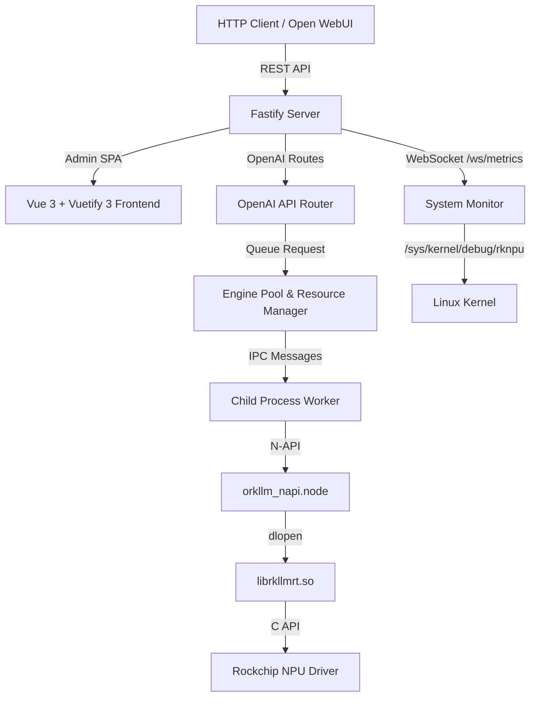

@README.md

# oRKLLM — Agent Instructions & Architecture

oRKLLM is an OpenAI API-compatible local LLM inference server and admin application designed for Rockchip NPU-powered platforms (specifically the **RK3576** found in the NanoPi M5 and **RK3588** series).

This project draws architectural inspiration from [oMLX](https://github.com/jundot/omlx) (optimized for Apple Silicon / MLX) but adaptively re-engineered to run on the Rockchip RKLLM runtime (`librkllmrt.so`) with its unique hardware constraints.

---

## 1. Executive Summary & Design Goals

The main objective of **oRKLLM** is to turn low-power Rockchip SBCs (Single Board Computers) into high-performance, self-hosted, private AI endpoints.

### Core Goals:
1. **OpenAI API Compatibility**: standard `/v1/chat/completions`, `/v1/completions`, `/v1/embeddings`.
2. **Admin Dashboard**: responsive web console for NPU/CPU/RAM/Temp monitoring, settings, model load/unload, real-time inference testing.
3. **NPU Resource Management**: serialize inference calls, manage model swaps within NPU memory constraints.
4. **Zero-Inference Dependencies**: runs in-process on the board — no cloud, no PyTorch, no heavy toolchains.

---

## 1a. Development Philosophy

oRKLLM is a **Node.js / JavaScript project end-to-end**. All tooling decisions should reflect that.

### Language preference

- **Always prefer Node.js / JavaScript** for scripting, data processing, CI steps, test helpers, and one-off utilities.
- Use `node -e "..."` or inline `node << 'EOF' ... EOF` in shell scripts and CI workflows.
- **Never default to Python** unless it is the only viable option (e.g. `rkllm-toolkit` model conversion, which is a Python-only SDK). If you reach for `python3`, stop and ask whether Node.js can do it instead.

### Git hygiene

- **Prefer fast-forward merges** whenever practical. Use `git merge --ff-only` or rebase rather than creating unnecessary merge commits.
- **Keep history linear and clean.** A flat history is easier to bisect, revert, and understand.
- Avoid `--no-verify`, force pushes to shared branches, or amending published commits.
- Cherry-pick single commits (e.g. hotfixes, docs) to `main` rather than merging an entire branch when only one commit is relevant.
- **No commit-message trailers.** Do not append `Co-Authored-By:` lines, `🤖 Generated with…` lines, or any tool/assistant attribution to commit messages or PR bodies. Keep messages to the change itself. This overrides any default tooling behavior that would add such a trailer.

### Branch promotion flow

All development happens on `alpha`. Promotions flow strictly forward — **never commit directly to `beta` or `main`, and never cherry-pick from beta/main back to alpha.**

```
alpha  →  beta  →  main
```

| Action | Command |
| :----- | :------ |
| Promote alpha → beta | `git push origin alpha:beta` |
| Promote beta → main | `git push origin beta:main` |

These are fast-forward pushes — no checkout, no merge commit, no conflicts. They only work when the target branch is strictly behind the source. If a conflict arises, it means something was committed directly to the target branch, which is the mistake to avoid.

**Never use `--no-ff` for promotions.** A merge commit on `beta` or `main` creates a divergence that breaks future fast-forwards and forces either cherry-picks (wrong direction) or force pushes (blocked on shared branches).

### Documentation review on every commit

**Before committing any change**, review `AGENTS.md` and `README.md` to determine if they need updating:

- Did you add, remove, or rename a source file, API endpoint, env variable, or feature? → Update **both** files.
- Did you change a CI workflow, test command, or deployment step? → Update the relevant section.
- Minor bug fixes and test-only changes typically don't require doc updates, but verify.

This is a soft requirement — use judgement. The goal is to keep docs reflecting reality so future agents don't have to reverse-engineer what changed. In practice: parse JSON / make HTTP requests / process files in CI with `node -e` or `.mjs` scripts, not `python3`; use `jq` for simple data munging, Node.js for complex.

### Toolchain

- **Runtime**: Node.js (backend, scripts, CI inline code)
- **Frontend**: Vue 3 + Vuetify 3, built with Vite
- **Tests**: Playwright (E2E), no unit test framework currently
- **CI scripting**: Bash + `node -e` / `node << 'EOF'`, never Python
- **Exception**: `rkllm-toolkit` model conversion on the build host (10.3.0.241) requires Python — that is the only sanctioned Python use

---

## 2. Implemented Stack

The project was re-engineered from a Python/FastAPI concept to a fully Node.js stack:

| Layer | Technology |
| :--- | :--- |
| **API Server** | Node.js + Fastify |
| **Native Bindings** | C++ N-API addon (`node-addon-api`) with `dlopen`/`dlsym` for `librkllmrt.so` |
| **Mock Fallback** | Pure JS mock engine (auto-enabled on non-ARM/non-Linux platforms) |
| **Frontend** | Vue 3 + Vuetify 3 SPA, built with Vite, served statically by Fastify |
| **Database** | SQLite via `node:sqlite` (Node ≥22.5) or `node-sqlite3-wasm` fallback (Node <22.5) — WASM, no native ABI lock, runs on any Node major/arch |
| **E2E Tests** | Playwright |

---

## 3. Hardware & Runtime Constraints of RK3576 (NanoPi M5)

The **NanoPi M5** is powered by the Rockchip **RK3576** SoC:

- **Performance**: 6 TOPS (INT8) NPU.
- **Model Format**: Models must be converted on an **x86 Linux PC** using `rkllm-toolkit` to `.rkllm` format.
- **Quantization**: Must use 4-bit (`w4a16`) or 8-bit (`w8a8`).
- **Active Model Constraint**: Only **one model** can be loaded in NPU memory at a time.
- **Serial Execution**: `rkllm_run` must be called serially. All inference is serialized via a dedicated queue.

---

## 4. Architecture



### Key Components

| File | Role |
| :--- | :--- |
| `src/addon/orkllm_napi.cpp` | C++ N-API addon; wraps `rkllm_init`, `rkllm_run`, `rkllm_destroy` with `Napi::ThreadSafeFunction` for non-blocking callbacks |
| `src/worker.js` | Process-isolated inference worker; receives `load`/`run`/`unload` IPC commands from pool |
| `src/pool.js` | Single-active-model lock, auto-swap, idle timeout, pin-to-keep-loaded; runtime version auto-discovery (`getAvailableRuntimes`, `readSoVersion`, `runtimeCandidates`, `_tryLoad`), caches winning lib path; `prefillAndCache` (abort-after-first-token KV warm); `generateSpeculative`/`generateEagle3`, `loadDraft`/`unloadDraft` for second worker slot. Pool size capped at chipset NPU core count (`getNpuCoreCount`); with >1 slot each model is pinned to its own core via `base_domain_id=(slot%cores)+1` (parallel models), single slot stays unpinned (all cores) |
| `src/config.js` (chipset) | `getPlatform()` (SoC slug from `/proc/device-tree/compatible`) + `getNpuCoreCount()` (rk3576→2, rk3588→3, else 1) — single source of truth, surfaced in `/api/admin/status` as `platform`/`npuCores` |
| `src/admin/conversations.js` | 6 REST endpoints for conversation CRUD + message append (`/api/admin/conversations/…`) |
| `src/tailscale.js` | Optional, runtime-detected Tailscale integration (never an apt dependency): `isAvailable()` (`which tailscale`), `getState()` (status/serve/url), `up({authKey,hostname})` (headless join, key never persisted/logged), `enableServe`/`disableServe` (`tailscale serve --bg <port>` / `reset`); pure helpers `summarizeStatus`/`serveUrlFromDNSName`/`scrubKey`. Admin endpoints `GET /api/admin/tailscale`, `POST /api/admin/tailscale/{setup,serve}`. UI in SiteManagement → Remote Access tab |
| `src/admin/mcp.js` | REST endpoints for MCP server CRUD (`/api/admin/mcp-servers`): list, create (optional validate), patch, delete, `:id/test`, `/validate` (unsaved payload); `GET /api/admin/mcp-tools` aggregates enabled servers' tools + returns the ready-to-inject system-prompt block |
| `src/mcp.js` | MCP client layer over `@modelcontextprotocol/sdk`: builds stdio/SSE/streamable-HTTP transports, `resolveHeaders()` turns structured `config.auth` (none/bearer/apikey/basic/custom) into request headers (legacy plain `config.headers` still honored), validates a server (lists tools), caches live clients for enabled servers, aggregates tools into OpenAI function format (`mcp__<server>__<tool>` namespacing) filtered by per-server `config.allowedTools` (null/absent = all), executes tool calls; validation/aggregation failures are logged with transport+endpoint+cause |
| `src/mcp_inference.js` | Prompt-driven tool-use loop (RKLLM has no native function-calling): builds a **compact** tool catalogue (one line per tool — name + short description + arg names, full JSON schemas omitted — capped at `TOOL_CATALOG_CHAR_BUDGET` so it can't overflow the context window), parses `<tool_call>{…}</tool_call>`, executes via `src/mcp.js`, feeds `tool` results back, re-generates; caps at `MAX_TOOL_ROUNDS` (5). Injectable `runTool` for unit testing |
| `src/runtime_sync.js` | Downloads aarch64 `librkllmrt.so` versions from the mirror list (`RUNTIME_MIRRORS`, override via `ORKLLM_RUNTIME_MIRRORS`) into `RUNTIMES_DIR`, first hit wins; skips non-ARM64-Linux; runs on startup, on load failure, and via `POST /api/admin/runtimes/sync` |
| `src/monitor.js` | Polls CPU, RAM, SoC Temp, NPU load, GPU load (Mali), disk utilization; Rockchip-native on ARM64 Linux, simulated elsewhere |
| `src/stats.js` | Records prefill/generation tokens and latencies in SQLite |
| `src/db.js` | SQLite + PRAGMA user_version migration runner; 5 versioned migrations; all table accessors (incl. `mcp_servers`, `bench_runs`) |
| `src/config.js` | Env-driven settings; multi-user credential helpers; PBKDF2-HMAC-SHA256 |
| `src/cache.js` | Tiered SSD prefix KV cache (hot/cold LRU), sliding context window trim |
| `src/server.js` | Fastify bootstrap; trustProxy config; mounts `/ws/metrics`, `/ws/logs`, static SPA, API routes |
| `src/api/routes.js` | `/v1/chat/completions` (SSE streaming + prefix cache; MCP tool-use loop when enabled), `/v1/models` (recursive scan of MODELS_DIR including subdirectories), `/v1/embeddings` |
| `src/admin/routes.js` | Auth (local + OIDC + SAML), user CRUD, RBAC, HF proxy, audit log, settings (incl. trustedProxy, pinnedModel) |
| `src/auth/routes.js` | OIDC (PKCE + confidential) and SAML 2.0 routes at `/auth/*` |
| `src/auth/session.js` | Shared signCookie / verifyCookie / issueSessionCookie (userId\|username\|role\|expires\|HMAC) |
| `src/mock_engine.js` | JS mock engine streaming realistic fake tokens (for macOS dev) |
| `frontend/src/components/AppNav.vue` | Shared navbar; Site Management item for admins; provider chip |
| `frontend/src/views/Dashboard.vue` | Serving stats, hardware telemetry, inference playground |
| `frontend/src/views/Models.vue` | Model manager + HF search/collection browser/downloader; recursive model scan; platform-aware search; download queue grouped by repo |
| `frontend/src/components/RuntimeSyncDialog.vue` | Reusable JIT runtime download progress dialog; shown during model load when a runtime is being fetched; used by Models and Chat pages |
| `frontend/src/notify.js` | Global notification store; `notify(message, color, timeout, action?)` drives a `v-snackbar` in `App.vue` via `app.config.globalProperties.$notify` (optional `action {label,onClick}` renders an extra button); replaces all `alert()` browser popups |
| `frontend/vite.config.js` | Vite build; `vite-plugin-pwa` (`registerType: autoUpdate`) emits the manifest + service worker — precaches the app shell, `navigateFallbackDenylist` keeps `/api`,`/v1`,`/ws` network-only (no `runtimeCaching`). PNG icons in `frontend/public/` (`pwa-*`, `apple-touch-icon`, maskable). SW registered in `main.js`, which also calls a public `GET /api/version` on load and force-updates the SW when the cached client is behind the server (deterministic staleness check, no reload loop). Static serving in `src/server.js` sends `Cache-Control: no-cache` for `sw.js`/manifest/`index.html`, `immutable` for hashed `assets/*` |
| `frontend/src/bench.js` | Module-scope `reactive()` benchmark store (`benchState`, `runBenchmark`, `abortBenchmark`); keeps the streaming run + results alive across route changes so `Bench.vue` can unmount/remount without losing state |
| `frontend/src/chat.js` | Module-scope `reactive()` chat-session store (`chatState`, `sendMessage`, `abortGeneration`, conversation CRUD); an in-flight generation and its conversation survive navigating away from `/chat` and back. Partial-response `sendBeacon` is registered here on `pagehide` (true page unload only) |
| `frontend/src/views/Settings.vue` | Global settings, HF token, prefix cache config, trusted proxy, MCP servers (table + add/edit dialog with transport-adaptive fields and an auth-type selector — none/bearer/apikey/basic/custom — that builds `config.auth`; test/validate, a per-tool allow-list picker — Test/Load tools then check which to expose, persisted as `config.allowedTools`; enable toggle, "use MCP tools in inference" switch) |
| `frontend/src/views/Logs.vue` | Full-page live log terminal (WebSocket) |
| `frontend/src/views/Bench.vue` | Inference benchmark (TTFT, tok/s); completed runs persist to `bench_runs` (`/api/admin/bench-runs`) and show in a Previous Runs table |
| `frontend/src/views/Chat.vue` | Full streaming chat against OpenAI-compatible API; system-prompt panel has an "Inject MCP tool instructions" toggle that fetches `/api/admin/mcp-tools` (showing tool count + approx token cost) and adds/removes a delimited tool-instructions block in the system prompt |
| `frontend/src/views/SiteManagement.vue` | Admin-only: user CRUD, OIDC/SAML config, audit log |
| `frontend/src/views/Login.vue` | Login page; shows SSO button when OIDC/SAML configured |
| `e2e/orkllm.spec.js` | Playwright E2E suite (41 tests — core flow, chat history, runtime, auto-download, download queue, dashboard, platform detection) |
| `e2e/rbac.spec.js` | Playwright E2E suite (17 tests — RBAC, trusted proxy (single + multi-IP/CIDR), mock OIDC SSO, Keycloak integration) |
| `e2e/regression.spec.js` | Playwright E2E suite (19 tests — UI regression: navbar, theme, user drawer, drawer toggles, Contribute button, snackbar, Bench/Chat state persistence across navigation, MCP server CRUD + inference toggle + Chat tool-instructions toggle) |

**Other paths:** `src/` also holds `auth/` (OIDC/SAML/session) and `eagle.js`. Non-source: `models/` (`.rkllm` files), `frontend/` (Vue 3 + Vuetify 3 SPA, Vite), `e2e/` (Playwright), root build config (`package.json`, `binding.gyp`, `playwright.config.js`). `CLAUDE.md` and `GEMINI.md` both `@AGENTS.md`.

---

## 5. Local Development

### Prerequisites
- Node.js ≥ 18 (≥ 22.5 preferred for native `node:sqlite`)
- `node-gyp` dependencies: Python 3, C++ compiler (Xcode CLT on macOS)

### Setup & Run

```bash
# Install all dependencies (compiles native addon)
npm install

# Build Vue frontend
npm run build:frontend

# Start development server (mock engine auto-enabled on macOS)
npm run dev:server
# → http://localhost:8000/admin
```

### Environment Variables

| Variable | Default | Description |
| :--- | :--- | :--- |
| `ORKLLM_HOST` | `127.0.0.1` | Listen address |
| `ORKLLM_PORT` | `8000` | Listen port |
| `ORKLLM_LIB_PATH` | *(auto-detect)* | Path to `librkllmrt.so` (system fallback when no versioned runtime matches) |
| `ORKLLM_MODELS_DIR` | `./models` | Directory scanned for `.rkllm` files |
| `ORKLLM_DB_PATH` | `~/.config/orkllm/auth.db` | SQLite database path |
| `ORKLLM_RUNTIMES_DIR` | `~/.config/orkllm/runtimes` | Directory of versioned `librkllmrt-aarch64-vX.Y.Z.so` files for auto-matching |
| `ORKLLM_RUNTIME_MIRRORS` | `oRKLLM/rkllm-runtimes,mafischer/rkllm-runtimes` | Comma-separated GitHub repo slugs tried in order when downloading runtime `.so` files — first mirror with the version wins |

---

## 6. E2E Testing

The Playwright suite covers the full user journey in mock mode (no board required):

```bash
npm test
# or
npx playwright test
```

Tests cover:
- **First-launch setup** — redirects to `/setup`, creates credentials
- **Auth enforcement** — logout → login redirect, wrong password alert
- **Dashboard** — telemetry gauges visible, navbar does not overlap content
- **Model lifecycle** — scan, load, mock chat stream with prefill/rate metrics
- **Log terminal** — real-time WebSocket log capture
- **RBAC** — Site Management visible for admin, user/provider CRUD, SSO button on login
- **Trusted proxy** — `trustedProxy` setting saved and returned correctly; comma-separated IP list and CIDR list round-trip correctly
- **Runtime auto-download** — `autoDownloadRuntimes` setting toggled and persisted; `/v1/models` returns `runtimeVersion` per model; `/api/admin/runtimes/download` accepts a version; Setup page has opt-in checkbox; Settings page has toggle
- **Mock OIDC SSO** (CI) — full OIDC authorize → login → callback flow via `mock-oauth2-server`
- **Real Keycloak SSO** (local, `ORKLLM_TEST_LIVE=1`) — full flow against `auth-lab.fischerapps.com`

### SSO test modes

| Mode | When | How |
|------|------|-----|
| **Mock OIDC (CI)** | `ORKLLM_TEST_MOCK_OIDC_URL` is set | `mock-oauth2-server` service container; nginx proxies port 80 → 18000; `/etc/hosts` maps `orkllm.fischerapps.com` → `127.0.0.1` |
| **Real Keycloak (local)** | `ORKLLM_TEST_LIVE=1` + `ORKLLM_TEST_LIVE_URL` set | Hits real Keycloak at `auth-lab.fischerapps.com`; requires LAN DNS resolution |
| **Skipped** | Neither set | SSO tests skip gracefully |

Identity provider credentials are read from environment variables. Set them in `.env` locally
(gitignored) or as GitHub Actions secrets/variables. See `.env` for variable names.

### Why tests run sequentially (`workers: 1`)

The three spec files share one stateful server (model in NPU, auth sessions, OIDC config); parallel runs would race (two models loading at once, OIDC config leaking across login flows). Ordering is intentional — `orkllm.spec.js` creates the admin account `rbac.spec.js` depends on. Parallelism would require per-worker isolated servers (separate ports + DB paths) and fully self-contained specs — a refactor not worth it given ~40s total runtime.

---

## 6a. Authentication & RBAC

### Architecture

- **Two roles**: `admin` (full access) and `user` (everything except site management)
- **Session cookie**: `userId|username|role|expires|HMAC-SHA256` — backward-compatible with legacy 3-part format
- **Shared session helpers**: `src/auth/session.js` — `signCookie`, `verifyCookie`, `issueSessionCookie`
- **Auto-migration**: on first start after upgrade, the single-user `auth` table is migrated to the multi-user `users` table via the DB migration runner
- **Local auth**: always available; admin can disable it once federated auth is working

### OIDC Flow — routes at `/auth/oidc/*` (src/auth/routes.js)
Admin configures issuer/client-ID/optional-secret/redirect-URI in Site Management → Auth Providers. Public clients (no secret) use PKCE (`code_verifier` + S256 `code_challenge`) automatically. `GET /authorize` → IdP with `state`+`nonce`(+`code_challenge`); `GET /callback` → exchange code → upsert user → session cookie. Group→role: OIDC `groups` claim mapped to `/orkllm` (user) / `/orkllm/admin` (admin).

### SAML Flow — routes at `/auth/saml/*` (src/auth/routes.js)
Admin pastes IdP metadata XML; SP metadata at `GET /metadata`. `GET /login` → AuthnRequest → IdP SSO; `POST /acs` → validate Response → upsert user → session cookie. Attribute mapping: configurable paths for username/email/groups.

### Trusted Proxy
Configure `ORKLLM_TRUSTED_PROXY` env var or the `trusted_proxy` setting in Site Settings.
Required when running behind nginx so `X-Forwarded-Proto` is honoured for OIDC redirect URIs.
Values: `true` (all proxies), a single IP/CIDR (e.g. `10.0.0.0/8`), a comma-separated list of IPs/CIDRs/hostnames (e.g. `10.0.0.1, 172.16.0.0/12`), or empty (disabled). Multiple entries are parsed into an array and passed directly to Fastify's `trustProxy`.
Takes effect on next server restart.

### Keycloak Configuration
- **Realm**: `https://auth-lab.fischerapps.com/realms/master`; OIDC client `orkllm-oidc` (Standard Flow, public, PKCE); SAML client `orkllm-saml`
- **Group paths**: `/orkllm` (user), `/orkllm/admin` (admin)
- **OIDC redirect URI**: `https://orkllm.fischerapps.com/auth/oidc/callback`; **SAML ACS**: `…/auth/saml/acs`; **SP metadata**: `…/auth/saml/metadata`

## 6b. Database Migrations

Schema changes are tracked via SQLite `PRAGMA user_version`. On startup, `runMigrations()` in `src/db.js` compares the stored version against `LATEST_VERSION` and runs any pending migrations in order.

### Adding a migration

Append to the `MIGRATIONS` array in `src/db.js`:

```js
{
  version: 3,
  description: 'Short description of change',
  up(d) {
    d.exec(`ALTER TABLE foo ADD COLUMN bar TEXT;`);
  },
},
```

**Rules:**
- Never edit an existing migration — add a new one
- Migrations must be synchronous (no async)
- `PRAGMA user_version` is updated atomically after each successful migration
- The current schema version is exposed at `GET /api/admin/status` → `schemaVersion`

### Current migrations

| Version | Description |
|---------|-------------|
| v1 | Initial schema: auth, stats, settings, model_settings |
| v2 | Multi-user RBAC: users, auth_provider_config, audit_log |
| v3 | Chat history: conversations, messages (with FK cascade delete and indexes) |
| v4 | MCP servers: mcp_servers table (id, name, transport, config JSON, enabled) |
| v5 | Benchmark history: bench_runs table (model, ttft/prefill/gen metrics, tokens, timestamp) |

---

## 7. Deployment to NanoPi M5

Target board: **NanoPi M5** (`10.6.0.14`) running Rockchip Linux (ARM64).

### 7.1 One-Time Board Setup

Done once: verify NPU driver (`ssh michael@10.6.0.14 'cat /sys/kernel/debug/rknpu/version'` → e.g. `0.9.8`), verify `librkllmrt.so` is present at `/home/michael/rkllama/src/rkllama/lib/librkllmrt.so`, and confirm Node.js is installed (tested with v20.20.2).

### 7.2 Deploy Steps

The full deploy is the copy-paste script in **7.3** below. Key points it encodes:

- **Build frontend first** (`npm run build:frontend` on macOS) — always rebuild so the latest UI ships.
- **`rsync` excludes `build/`** — it holds the macOS Mach-O binary, which would overwrite the ARM64 ELF compiled on the board (silent mock fallback otherwise). Also exclude `.git`, `node_modules`, test artifacts.
- **`npm install` on the board** compiles the ARM64 native addons `build/Release/orkllm_napi.node` and `kvcache_quant_napi.node` (N-API — ABI-stable across Node majors). The SQLite fallback (`node-sqlite3-wasm`) is pure WASM, so it needs no compilation and carries no Node-ABI lock.
- **Restart** = `pkill -f 'node src/server.js'` then `nohup env … node src/server.js`.
- **Verify**: `ps aux | grep 'node src/server'`; open `http://10.6.0.14:8000/admin`. Expected log: `Server listening at http://0.0.0.0:8000`.

### 7.3 Combined Deploy Script (copy-paste)

```bash
#!/usr/bin/env bash
set -e
BOARD=michael@10.6.0.14
BOARD_PATH=/home/michael/Dev/oRKLLM
LIB_PATH=/home/michael/rkllama/src/rkllama/lib/librkllmrt.so

echo "==> Building frontend..."
cd /Users/michael/Dev/oRKLLM
npm run build:frontend

echo "==> Syncing to board..."
rsync -avz \
  --exclude='.git' \
  --exclude='node_modules' \
  --exclude='build' \
  --exclude='test-results' \
  --exclude='test_auth.db' \
  --exclude='test_auth.json' \
  /Users/michael/Dev/oRKLLM/ $BOARD:$BOARD_PATH/

echo "==> Installing dependencies on board..."
ssh -n $BOARD "cd $BOARD_PATH && npm install"

echo "==> Restarting server..."
ssh -n $BOARD "
  pkill -f 'node src/server.js' || true
  sleep 1
  cd $BOARD_PATH
  nohup env ORKLLM_HOST=0.0.0.0 ORKLLM_PORT=8000 ORKLLM_LIB_PATH=$LIB_PATH \
    node src/server.js > server.log 2>&1 &
  sleep 3 && tail -5 server.log
"
echo "==> Done! Admin console: http://10.6.0.14:8000/admin"
```

---

## 7a. Model Naming Convention

oRKLLM promotes a single unified naming standard across the Rockchip community. When generating filenames, parsing model metadata, or documenting models, always follow this convention.

### Unified format (repo name and filename are identical, filename adds `.rkllm`)

```
{Family}-{Params}-{Variant}-{Chipset}-{Quant}-{Algo}-v{Version}-RKLLM.rkllm
```

- **HuggingFace repo:** `Qwen3-4B-Base-rk3576-w4a16-grq-v1.2.3-RKLLM`
- **File inside repo:** `Qwen3-4B-Base-rk3576-w4a16-grq-v1.2.3-RKLLM.rkllm`

| Field | Description | Example |
|-------|-------------|---------|
| `Family` | Base model name | `Qwen3`, `Llama3` |
| `Params` | Parameter count | `4B`, `8B`, `35BA3B` |
| `Variant` | Model variant | `Base`, `Instruct`, `Chat` |
| `Chipset` | Target Rockchip SoC | `rk3576`, `rk3588` |
| `Quant` | Quantization type | `w4a16`, `w8a8` |
| `Algo` | Quantization algorithm | `grq`, `awq`, `gptq` |
| `Version` | rkllm-toolkit version (with `v` prefix) | `v1.2.3` |
| `RKLLM` | Required for HuggingFace discoverability | — |

**`parseRuntimeVersion()` in `src/config.js`** extracts the version from `v{Version}` in the filename to auto-select the correct `librkllmrt.so`. Always include the `v`-prefixed version. Legacy files without the `v` prefix or `-RKLLM` suffix are also matched by the regex for backward compatibility.

### Required HuggingFace tags

```
rkllm  rockchip  npu  rk3576  rk3588  <model-family-lowercase>  rknn
```

Include the applicable chipset tag(s). This enables oRKLLM's **Compatible chipset** search filter.

---

## 8. Implementation Roadmap

| Phase | Status | Description |
| :--- | :--- | :--- |
| Phase 1: Environment Probe | ✅ Done | SSH to board, verified NPU driver v0.9.8+, located `librkllmrt.so` |
| Phase 2: N-API Bindings | ✅ Done | `orkllm_napi.cpp` with `dlopen`/`dlsym` + `Napi::ThreadSafeFunction` |
| Phase 3: Inference Core | ✅ Done | `pool.js` + `worker.js` with single-active-model lock and idle timeout |
| Phase 4: Web Server & API | ✅ Done | Fastify + OpenAI routes + SSE streaming + WebSocket telemetry |
| Phase 5: Admin Dashboard UI | ✅ Done | Vue 3 + Vuetify 3 SPA with Chat Arena, telemetry gauges, log terminal |
| Phase 6: E2E Tests | ✅ Done | Playwright suite covering full user journey in mock mode |
| Phase 7: Board Deployment | ✅ Done | Deployed to NanoPi M5 at `10.6.0.14`, confirmed listening on port 8000 |
| Phase 8: Auth & RBAC | ✅ Done | OIDC/SAML federated auth, multi-user RBAC, Site Management UI, Keycloak integration |
| Phase 9: Prefix Cache | ✅ Done | Tiered SSD KV cache, sliding context window, cache stats in Settings |
| Phase 10: CI/CD | ✅ Done | GitHub Actions: parallel CI + Release, Trivy scan, dynamic shields.io badges |
| Phase 11: DB Migrations | ✅ Done | PRAGMA user_version migration runner, v1-v3 migrations, schema version in status API |
| Phase 12: Trusted Proxy | ✅ Done | Fastify trustProxy from env/DB setting; comma-separated multi-IP/CIDR support; UI config in Settings |
| Phase 13: SSO E2E Tests | ✅ Done | mock-oauth2-server service container in CI, nginx port proxy, real Keycloak locally |
| Phase 14: APT Channels | ✅ Done | Separate `dists/stable/`, `dists/beta/`, `dists/alpha/` on gh-pages; release workflow maps branch → channel |
| Phase 15: Chat UX | ✅ Done | Input pinned at bottom (fixed viewport); message queueing during inference; mobile responsive layout |
| Phase 16: Conversation History | ✅ Done | SQLite v3 migration; conversations + messages tables; collapsible sidebar (desktop) / bottom-sheet (mobile); `sendBeacon` on unload for partial responses |
| Phase 17: Pin Model | ✅ Done | Pin persists to DB (`pinned_model` setting); auto-load on startup with RAM check (1.2× model size); clears on unload |
| Phase 18: Runtime Version Matching | ✅ Done | Versioned `.so` in `RUNTIMES_DIR`; `readSoVersion()` via `strings`; `runtimeCandidates()` orders cached winner → filename match → others → system fallback; `GET /api/admin/runtimes`; mirror at `oRKLLM/rkllm-runtimes` |
| Phase 19: Runtime Auto-Download | ✅ Done | Setup opt-in (default on); `runtime_sync.js` downloads from mirror on startup + targeted sync on load failure; opt-out disclaimer dialog; API 422 `RUNTIME_MISSING`; `autoDownloadRuntimes` setting |
| Phase 20: Model Downloader | ✅ Done | HF search + collection browse; Download queues all repo files in parallel to `MODELS_DIR/{repoName}/`; queue persists across navigation, grouped by repo, per-file progress/speed |
| Phase 21: Platform-Aware Search | ✅ Done | `/api/admin/status` returns `platform` (`rk3576`/`rk3588`/`null`) from device-tree; "Compatible chipset" filter appends slug to HF query; recursive scan of `models/{repoName}/`; wildcard model routes |
| Phase 22: Speculative Decode (research) | 🔬 Research | Draft+target pool (`generateSpeculative`, `loadDraft`/`unloadDraft`); no speedup on single NPU; Eagle-3 viable at 3.73× — Sections 9 & 10 |
| Phase 23: prefillAndCache | ✅ Done | Abort-after-first-token KV save; `POST /api/admin/prefill-cache`, `/infer-with-cache`; 75% (4B) / 100% (8B) prefill reduction; needs model reload between warm and serve — Section 9 |
| Phase 24: MCP servers | ✅ Done | DB v4 `mcp_servers`; admin CRUD + validate/test (`/api/admin/mcp-servers`); Settings UI (stdio/SSE/HTTP transports); `@modelcontextprotocol/sdk` client (`src/mcp.js`); prompt-driven tool-use loop in `/v1/chat/completions` gated by `mcp_inference_enabled` (`src/mcp_inference.js`) |

---

## 9. NPU Inference Optimization — Research Findings

Empirical results from hardware experiments on the NanoPi M5 (RK3576). Read before attempting related work.

### 9.1 Speculative Decoding

**Standard draft+target (separate models): no measurable speedup on a single NPU.** Implemented as `pool.generateSpeculative()` (draft generates `k` tokens serially, target verifies in one pass via `RKLLM_INFER_GET_LOGITS`). On a single NPU only one model fits at a time, so draft and target run sequentially; at comparable per-token throughput the draft+verify overhead negates any acceptance-rate gain. Speedup needs the draft to be substantially faster than the target *on the same hardware* — not the case here.

**Eagle-3 IS applicable and IS implemented** (`pool.generateEagle3()` + `src/eagle.js`). Unlike standard draft+target: the draft head runs on the **Mali GPU** (separate hardware) while the target verifies on the **NPU** via `GET_LOGITS`; the two run **concurrently** — Mali is hidden inside the NPU's ~2200ms verification window. Empirically validated at **3.73× speedup** (k=8, 80% acceptance — see Section 10).

**Key IPC race (fixed):** `rkllm_abort` is asynchronous; stale tokens from the old run leak into the next listener unless code waits for `state === 2` first. Fix: `abortAndFinish()` in `pool.js` sends abort then awaits `state: 2` with a 500ms timeout.

### 9.2 prefillAndCache — 63–100% prefill reduction; requires model reload between warm and serve

`pool.prefillAndCache(prompt, savePath)` runs `rkllm_run` with `saveCachePath` and aborts immediately after the first decode token; RKLLM saves the KV state before returning `state: 2`, yielding a prefill-only snapshot.

| Model | Baseline prefill | Cached prefill | Reduction | Warm cost |
|-------|-----------------|----------------|-----------|-----------|
| Qwen3-4B-Base | 69 tok / 1446 ms | 9 tok / 361 ms | **75%** | 692 ms |
| Qwen3-8B-Base | 57 tok / 1495 ms | 0 tok / 0 ms | **100%** | 831 ms |

The saved cache is a clean prefill snapshot (first token after load is the first *new* decode token, not a duplicate; the 9 residual 4B tokens are template-framing tokens RKLLM always re-processes).

**Critical constraint — model reload required:** calling `rkllm_run` with `loadCachePath` immediately after `prefillAndCache` crashes the worker (`state: 500`) — the abort leaves the engine's KV state dirty. Fix: unload and reload the model between warm and serve. Workflow: `load → prefillAndCache(systemPrompt, path) → unload → load → serve with loadCachePath`.

**vs `cache.js`:** both use the same `saveCachePath`/`loadCachePath` mechanism. `cache.js` is *reactive* (caches after first response; user #1 pays full prefill). `prefillAndCache` is *proactive* (warms at startup so even user #1 benefits) — narrow advantage for single-user, meaningful for multi-tenant fixed system prompts.

**Endpoints:** `POST /api/admin/prefill-cache {prompt, savePath}` → `{firstToken, savedPath}`; `POST /api/admin/infer-with-cache {prompt, loadCachePath?, saveCachePath?, maxTokens?}` → `{text, perf}` (test/debug; accepts empty `prompt` when `loadCachePath` set).

### 9.3 FP8 KV Cache — not supported

RK3576 NPU has no FP8 hardware (FP8 needs tensor cores present only on H100/Ada-class data-centre GPUs); it operates at INT8/INT16/FP16. `RKLLMParam` exposes no KV-cache dtype field, and a `strings` scan of `librkllmrt-aarch64-v1.2.3.so` finds no `fp8`/`kv_quant`/`cache_quant`. INT8 KV quantisation is also absent from the API.

### 9.4 .rkllmcache File Format — fully reverse-engineered

Three-section binary. `file_size = 615,371 + 147,472 × n_tokens` (exact, verified across 5 files).

| Section | Offset | Size | Content |
|---------|--------|------|---------|
| Metadata header | `0x000–0x125` | 294 B | 10× LE int32: `H[0]=43`, `H[1]=n_kv_heads (8)`, `H[2]=n_tokens`, `H[3]=151644`, … |
| Fixed model overhead | `0x126–0x963ca` | 615,077 B | Constant per model regardless of context. FP16 in `[0.0, 0.65]` — likely quant scales or RoPE tables. **Do not modify** (not fully decoded). |
| FP16 KV tensor data | `0x963cb–EOF` | `147,472 × n_tokens` B | Token-sequential `[tok_0 K+V]…`. Per token: `2 × 36L × 8H × 128D × 2B FP16 + 16B padding = 147,472`. |

Measurements (4B, 61-token): FP16 KV range −117..+293, mean |abs| ≈ 1.07; token 0 (BOS) ≈ all-zero K+V; zlib only compresses 7% (high-entropy activations).

**INT8 quantisation of the KV section is feasible** (per layer×head scale): INT8 values 73,728 B + FP32 scales 2,304 B = 76,032 B/token vs 147,472 FP16 (**48%/token**, ~45% full file). Path: copy `0x000–0x963ca` verbatim, then per-token reshape `36×8×2×128` FP16 → per-(layer,head,K/V) INT8 scale+zero-point (preserve 16B padding); store `.q8cache`, dequantise to a temp FP16 file before `loadCachePath` (~10ms). Do **not** touch the fixed overhead (possibly per-dim scales or a RoPE table — modifying risks corruption).

---

## 10. NPU Parallelism, GET_LOGITS Scaling, and Eagle-3 Feasibility

Empirical findings (NanoPi M5 / RK3576). Read before attempting related work.

### 10.1 NPU Core Count — `npu_core_num: 2`

Every `rkllm_init` logs `npu_core_num`: **RK3576 = 2 cores**, **RK3588 = 3 cores** (confirmed on the Rock 5B: `npu_core_num: 3, target_platform: RK3588`). The advertised TOPS is total compute; the cores are its internal subdivision. `RKLLMExtendParam.base_domain_id` picks the starting domain/core.

**Per-worker core pinning works (PoC-validated).** A single model left unpinned claims all cores — which means a *second* `rkllm_init` has no core left and fails to load. Pinning each worker process to its own `base_domain_id` (1, 2, 3…) lets up to `npu_core_num` models load and run in **parallel, one core each**. The engine pool now does this automatically: `getNpuCoreCount()` (`src/config.js`) drives the pool-size cap and per-slot `base_domain_id=(slot%cores)+1` (a single slot stays unpinned for max single-model throughput). Earlier notes that "`base_domain_id=2` has no effect on RK3576" referred to a *single* model still spanning both domains — distinct from the multi-worker parallel case above, which does isolate per core.

### 10.2 Parallel NPU Inference — two models simultaneously

Two worker processes, each loading a different model (0.6B + 1.7B), run concurrently:

| Config | 0.6B | 1.7B | Wall |
|---|---|---|---|
| Sequential | 4.0s | 6.5s | 10.5s |
| **Parallel** | **4.4s** | **6.5s** | **6.5s** |

Both `rkllm_init` calls succeed and produce valid output; each runs at ~85–90% of single-model throughput (not 50% — memory-bandwidth stall windows let the second model's compute slip through). **Two models CAN run simultaneously** — the hardware foundation for multi-worker serving and Eagle-3.

### 10.3 RKLLM Inference Modes (`RKLLMInferMode`, wired in `orkllm_napi.cpp`)

| Mode | Value | Returns | Use |
|------|-------|---------|-----|
| `RKLLM_INFER_GENERATE` | 0 | autoregressive tokens | default path |
| `RKLLM_INFER_GET_LAST_HIDDEN_LAYER` | 1 | `hidden_states [num_tokens × embd_size]` | Eagle-3 draft input |
| `RKLLM_INFER_GET_LOGITS` | 2 | `logits [vocab_size × num_tokens]` | Eagle-3 verification |

Exposed via `infer_mode` in `run` IPC and the `POST /api/admin/infer-with-cache` endpoint.

### 10.4 GET_LOGITS scales as constant time (parallel prefill)

`eagle_verify_bench.mjs`, GET_LOGITS vs k sequential GENERATE (1.7B, 5 trials):

| k | k × GENERATE | GET_LOGITS | ratio |
|---|---|---|---|
| 1 | 2201ms | 2201ms | 100% |
| 2 | 4635ms | 2203ms | **48%** |
| 4 | 9503ms | 2194ms | **23%** |
| 8 | 19359ms | 2229ms | **12%** |

**RKLLM processes k tokens via GET_LOGITS in constant time** — a true parallel prefill batch. Verifying k draft tokens costs the same as verifying 1. This is the decisive enabler for Eagle-3 (measured, not assumed).

### 10.5 Eagle-3 feasibility — empirical verdict

Phase 4 of `eagle_verify_bench.mjs` (pipelined sim via `Promise.all([NPU verify, setTimeout(60ms)])`). Pipeline: NPU runs `GET_LAST_HIDDEN_LAYER`→`GET_LOGITS verify_N`→`verify_N+1` while Mali drafts `N+1`,`N+2` inside the 2200ms verify window.

| Config (k=4, 80% accept) | tok/s |
|---|---|
| Baseline (sequential GENERATE) | 0.5 |
| Sequential Eagle (no pipeline) | 0.4 ← slower |
| **Pipelined Eagle (NPU+Mali concurrent)** | **1.7** |
| **Speedup** | **3.73×** |

Fast because: GET_LOGITS(k) ≈ GET_LOGITS(1); Mali draft (~60ms) hides in the 2200ms NPU window; ~3.8 tokens/batch at 80% accept ÷ 2.2s = 1.7 tok/s. Sequential Eagle is slower than baseline because verify + sequential GENERATE exceeds k baseline generates. **Eagle-3 is definitively worthwhile on RK3576.**

### 10.6 Eagle-3 implementation (`src/eagle.js`)

**Optimal k = 8** (not 4): GET_LOGITS is constant-time in k, so k=8 → ~6× theoretical at 90% accept vs ~3.4× at k=4. Default in `src/eagle.js` and `src/api/routes.js`.

**Tokenizer-free design** via two addon/worker features: `RKLLM_INPUT_TOKEN` (`input_type=1`) passes `token_ids: Int32Array` directly — RKLLM decodes them with its own tokenizer and reports decoded text via the per-token callback (collected in `_tokenTexts`); `keep_history=1` appends new tokens to the existing KV cache so verification processes only the k draft IDs, not the whole context. No external tokenizer needed.

**KV rollback on partial rejection:** `keep_history=1` appends all k draft tokens; on partial accept (j<k) the rejected ones must be removed but RKLLM has no partial-rollback API. Approach: send `{type:'clear_cache'}` IPC (`rkllm_clear_kv_cache`), then re-run `GET_LAST_HIDDEN_LAYER(currentPrompt, keep_history=false)` to restore KV to the accepted prefix and get fresh hidden states. Cost at k=8/80%: rollback ≈ 0.20 × 2200ms = 440ms/batch vs 15,400ms/batch saved — still >3×.

Loop: `GET_LAST_HIDDEN_LAYER(prompt)` → draft `[d0..dk]` → **(concurrent)** NPU `GET_LOGITS(token_ids=[d0..dk], keep_history=true)` + Mali drafts next k → `rejectionSample(logits, draft)` → emit accepted via `_tokenTexts[i].text` → on partial rejection clearKV + re-run hidden-layer.

**Status:** `RKLLM_INPUT_TOKEN`, `keep_history`, `_tokenTexts` collection, KV rollback all ✅ wired. `cpuPlaceholderDraft` ✅ (loop validation, ~0% accept — placeholder IDs). `vulkanDraft` (Mali) 🚧 stub, falls through to CPU until a trained head exists. Trained draft head 🔄 in progress.

**Draft head naming:** `{Family}-{TargetParams}-Eagle3Draft-{DraftParams}-{Chipset}-{Quant}-{Algo}-v{Version}-EAGLE3.rkllm` — e.g. `Qwen3-VL-2B-Instruct-Eagle3Draft-445M-rk3576-w4a16-grq-v1.2.3-EAGLE3.rkllm`.

**Why 445M:** untied LM head `nn.Linear(2048, 151936)` = 311M; 2-layer SwiGLU body (intermediate 8192) = 134M. fp32 ~1.78GB, bf16 release ~891MB, w4a16 ~222MB on disk. Mali timing: the original 60ms estimate assumed ~50M; at 445M the LM-head matmul dominates — still under the 2200ms window on Mali G52, but benchmark on-board before relying on it.

**Training run (M5 Max):** `eagle3_pkg.train` via MLX; target `unsloth/Qwen3-VL-2B-Instruct` (frozen fp32); dataset `~/rkllm/data/combined/combined.parquet` (1,526,766 seqs → 1,511,499 train / 15,267 val, eval every 500 steps); 3 epochs, effective batch 16 (micro-batch 8 × grad-accum 2), 283,404 steps, cosine LR 0.0003→0.0, max-len 512, Metal cache 32GB, peak VRAM ~17–18.5GB; output `draft_head.safetensors` (bf16, ~891MB). Loss 10.80→8.43 in 3 steps after the zero-gradient fix.

**Bugs fixed in training:** (1) zero-gradient flatline — `draft_head.update(params)` inside `nn.value_and_grad` detaches the graph in MLX; fix is `nn.value_and_grad(model, loss_fn)` with model as first arg. (2) dual forward pass — unified into one `extract_hidden_states_and_logits()` (~50% target compute cut). (3) OOM — logits `[batch×seq_len×vocab]` was ~10GB at seq_len 2048; fixed via `--max-len 512` + grad-accum + `mx.clear_cache()`/`gc.collect()` per step.

**Post-training:** confirm `draft_head.safetensors` ~891MB (smaller ⇒ LM head accidentally tied); convert to `.rkllm` via `rkllm-toolkit` on x86 host `10.3.0.241` (w4a16); benchmark Mali forward pass on-board; rename per convention.

**prefillAndCache interaction:** independent — Eagle-3 runs its own `GET_LAST_HIDDEN_LAYER` from scratch and bypasses `cache.js`. Future: a "warm context" API that saves KV *and* returns hidden states in one pass.

**30% idle NPU:** single-token GENERATE leaves ~30% bandwidth idle (memory stalls); GET_LOGITS k=8 = k=1 wall time means the NPU fills those stalls with the extra tokens — why k=8 beats k=4 despite equal verify time.

### 10.7 Medusa Heads — revisit later

**TODO: evaluate as an alternative/complement to Eagle-3.** Medusa uses multiple independent heads on the target's `GET_LAST_HIDDEN_LAYER` output (no recurrent transformer): simpler to train, all heads run in one Vulkan dispatch on Mali, each predicts a different future position (token tree, not chain) for potentially higher acceptance via tree sampling. Uses the same `RKLLM_INPUT_TOKEN` + `keep_history` infra already wired. Deferred until Eagle-3 end-to-end is validated. (Draft head on Mali not NPU: a ~50MB model would waste a whole NPU domain on <3% of compute; Mali is separate hardware, ~60ms hidden in the verify window; pattern in `vk_quant.hpp`, `kvcache_quant_napi.cpp`.)

---

## 11. Verification Plan

### Automated (Local)
```bash
npm test   # Playwright E2E against local mock server
```

### Manual (On-Device)
1. Deploy via the script in Section 7.3 above.
2. Open `http://10.6.0.14:8000/admin`.
3. Complete first-launch setup (username + password).
4. Load a `.rkllm` model from the Model Explorer.
5. Send a prompt in the Chat Arena — verify NPU load spikes in the telemetry gauges.
6. Check logs terminal shows live server output.
