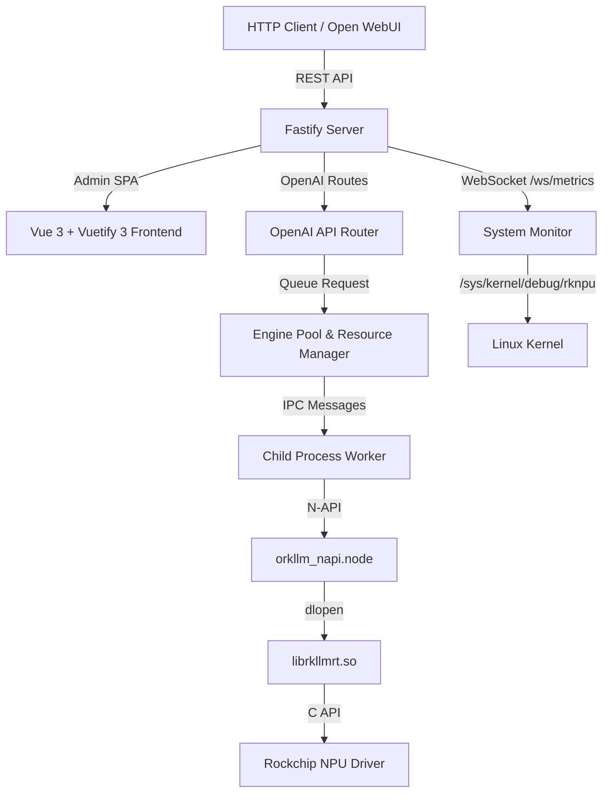

@README.md

# oRKLLM — Agent Instructions & Architecture

oRKLLM is an OpenAI API-compatible local LLM inference server and admin application designed for Rockchip NPU-powered platforms (specifically the **RK3576** found in the NanoPi M5 and **RK3588** series).

This project draws architectural inspiration from [oMLX](https://github.com/jundot/omlx) (optimized for Apple Silicon / MLX) but adaptively re-engineered to run on the Rockchip RKLLM runtime (`librkllmrt.so`) with its unique hardware constraints.

---

## 1. Executive Summary & Design Goals

The main objective of **oRKLLM** is to turn low-power Rockchip SBCs (Single Board Computers) into high-performance, self-hosted, private AI endpoints.

### Core Goals:
1. **OpenAI API Compatibility**: standard `/v1/chat/completions`, `/v1/completions`, `/v1/embeddings`.
2. **Admin Dashboard**: responsive web console for NPU/CPU/RAM/Temp monitoring, settings, model load/unload, real-time inference testing.
3. **NPU Resource Management**: serialize inference calls, manage model swaps within NPU memory constraints.
4. **Zero-Inference Dependencies**: runs in-process on the board — no cloud, no PyTorch, no heavy toolchains.

---

## 1a. Development Philosophy

oRKLLM is a **Node.js / JavaScript project end-to-end**. All tooling decisions should reflect that.

### Language preference

- **Always prefer Node.js / JavaScript** for scripting, data processing, CI steps, test helpers, and one-off utilities.
- Use `node -e "..."` or inline `node << 'EOF' ... EOF` in shell scripts and CI workflows.
- **Never default to Python** unless it is the only viable option (e.g. `rkllm-toolkit` model conversion, which is a Python-only SDK). If you reach for `python3`, stop and ask whether Node.js can do it instead.

### Git hygiene

- **Prefer fast-forward merges** whenever practical. Use `git merge --ff-only` or rebase rather than creating unnecessary merge commits.
- **Keep history linear and clean.** A flat history is easier to bisect, revert, and understand.
- Avoid `--no-verify`, force pushes to shared branches, or amending published commits.
- Cherry-pick single commits (e.g. hotfixes, docs) to `main` rather than merging an entire branch when only one commit is relevant.
- **No commit-message trailers.** Do not append `Co-Authored-By:` lines, `🤖 Generated with…` lines, or any tool/assistant attribution to commit messages or PR bodies. Keep messages to the change itself. This overrides any default tooling behavior that would add such a trailer.

### Branch promotion flow

All development happens on `alpha`. Promotions flow strictly forward — **never commit directly to `beta` or `main`, and never cherry-pick from beta/main back to alpha.**

Promotions/pushes to the `beta` and `main` branches are sensitive operations and **must be explicitly requested by the user** before execution.

```
alpha  →  beta  →  main
```

| Action | Command |
| :----- | :------ |
| Promote alpha → beta | `git push origin alpha:beta` |
| Promote beta → main | `git push origin beta:main` |

These are fast-forward pushes — no checkout, no merge commit, no conflicts. They only work when the target branch is strictly behind the source. If a conflict arises, it means something was committed directly to the target branch, which is the mistake to avoid.

**Never use `--no-ff` for promotions.** A merge commit on `beta` or `main` creates a divergence that breaks future fast-forwards and forces either cherry-picks (wrong direction) or force pushes (blocked on shared branches).

### Documentation review on every commit

**Before committing any change**, review `AGENTS.md` and `README.md` to determine if they need updating:

- Did you add, remove, or rename a source file, API endpoint, env variable, or feature? → Update **both** files.
- Did you change a CI workflow, test command, or deployment step? → Update the relevant section.
- Minor bug fixes and test-only changes typically don't require doc updates, but verify.

This is a soft requirement — use judgement. The goal is to keep docs reflecting reality so future agents don't have to reverse-engineer what changed. In practice: parse JSON / make HTTP requests / process files in CI with `node -e` or `.mjs` scripts, not `python3`; use `jq` for simple data munging, Node.js for complex.

### Toolchain

- **Runtime**: Node.js (backend, scripts, CI inline code)
- **Frontend**: Vue 3 + Vuetify 3, built with Vite
- **Tests**: Playwright (E2E), no unit test framework currently
- **CI scripting**: Bash + `node -e` / `node << 'EOF'`, never Python
- **Exception**: `rkllm-toolkit` model conversion on the build host (10.3.0.241) requires Python — that is the only sanctioned Python use

---

## 2. Implemented Stack

The project was re-engineered from a Python/FastAPI concept to a fully Node.js stack:

| Layer | Technology |
| :--- | :--- |
| **API Server** | Node.js + Fastify |
| **Native Bindings** | Two C++ N-API addons (`node-addon-api`) with `dlopen`/`dlsym`: `orkllm_napi.cpp` for `librkllmrt.so` (rkllm backend) and `orkllm_llama_napi.cpp` for `libllama.so` (llama/GGUF backend) |
| **Mock Fallback** | Pure JS mock engine (auto-enabled on non-ARM/non-Linux platforms) |
| **Frontend** | Vue 3 + Vuetify 3 SPA, built with Vite, served statically by Fastify |
| **Database** | SQLite via `node:sqlite` (Node ≥22.5) or `node-sqlite3-wasm` fallback (Node <22.5) — WASM, no native ABI lock, runs on any Node major/arch |
| **E2E Tests** | Playwright |

---

## 3. Hardware & Runtime Constraints of RK3576 (NanoPi M5)

The **NanoPi M5** is powered by the Rockchip **RK3576** SoC:

- **Performance**: 6 TOPS (INT8) NPU.
- **Model Format**: Models must be converted on an **x86 Linux PC** using `rkllm-toolkit` to `.rkllm` format.
- **Quantization**: Must use 4-bit (`w4a16`) or 8-bit (`w8a8`).
- **Active Model Constraint**: Only **one model** can be loaded in NPU memory at a time.
- **Serial Execution**: `rkllm_run` must be called serially. All inference is serialized via a dedicated queue.

---

## 4. Architecture



### Key Components

| File | Role |
| :--- | :--- |
| `src/addon/orkllm_napi.cpp` | C++ N-API addon; wraps `rkllm_init`, `rkllm_run`, `rkllm_destroy` with `Napi::ThreadSafeFunction` for non-blocking callbacks |
| `src/addon/orkllm_llama_napi.cpp` | C++ N-API addon for the llama/GGUF backend; `dlopen`s `libllama.so`; same method surface as `orkllm_napi.cpp` (`load_library`, `init_model`, `run`, `abort_inference`, `clear_kv_cache`); uses `llama_state_seq_save_file`/`llama_state_seq_load_file` for prefix-cache integration; KV cache file extension `.llamacache`. Sampling/generation params are applied **per-run** (the `run` IPC message carries `options`; the worker forwards `max_new_tokens`/`temperature`/`top_p`/`top_k`): `run` reads `max_new_tokens` for the generation cap and rebuilds the full sampler chain each call from the request's params, so a model's settings take effect without a reload. The chain is `[penalties?]→top_k→top_p→[min_p?]→temp→dist`, or `[penalties?]→temp→mirostat_v2` when mirostat>0; `repeat_penalty`/`presence_penalty`/`frequency_penalty` (via `llama_sampler_init_penalties`), `mirostat`/`mirostat_tau`/`mirostat_eta` (via `_mirostat_v2`), and `min_p` are all `dlsym`'d optionally (nullptr-guarded — skipped if libllama lacks them). The `dist`/`mirostat` seed is `LLAMA_RANDOM_SEED` (0xFFFFFFFF) so output varies per run. `ctx_window`→`n_ctx` and `thinking_enabled` (prompt seed in `routes.js`) also apply. Penalties/mirostat come from the saved per-model settings regardless of `force_sampling` (they aren't in the OpenAI request body). **KV-cache quantization** (init-time): `init_model` reads `kv_type_k`/`kv_type_v` from the load options and sets `llama_context_params.type_k`/`type_v` via `kvTypeFromStr` (f16=1, q4_0=2, q5_1=7, q8_0=8, **turbo2/3/4 = 42/43/44** — TurboQuant WHT+polar KV compression); turbo/quantized types require flash attention which the runtime auto-enables, so `flash_attn_type` is left at AUTO. Defaults to f16/f16; changing it forces a model re-init (resolved per-model in `pool.js`). Requires a runtime build that includes TurboQuant; runs the WHT/quant on the Mali GPU via the Vulkan backend. **Unified control + single-pass SSD blob**: the per-model "KV Cache Compression" dropdown (`kv_cache_quant`) is the single UI control — its TurboQuant levels (`turbo2/3/4`, shown only for llama models) are mapped in `pool.js` to `kv_type_v` (+ `kv_type_k=q8_0`, the asymmetric "never turbo K" policy). Because `llama_state_seq_save_file` serializes the KV cache in its native `type_v`, a turbo V-cache is written to the prefix-cache `.llamacache` blob already turbo-compressed — the same single GPU pass that built the live cache. The llama prefix cache is therefore a **separate implementation** from the rkllm one (`cache.js` `putCachePath` dispatches on `runtime`): the llama path never runs the `kvcache_quant_napi` PolarQuant (which understands only the rkllm `.rkllmcache` layout and, for turbo, would be a redundant lossy second pass). The legacy SSD PolarQuant (q8/pq8/pq4) is rkllm-only. **Selective Vulkan mode + n_gpu_layers** (init-time): `init_model` reads `vk_mode` (`turboquant`→1 / `prefill`→2 / else 0) and, if the optional `ggml_vk_set_mode` symbol is present in the runtime (nullptr-guarded), calls it **before model load** to scope the Vulkan backend; `n_gpu_layers` is also a load option (default 999). `pool.js` derives these from turbo: with turbo KV it sets `vk_mode:'turboquant'` + `n_gpu_layers:0` (Vulkan does only the KV/turbo ops, model weights/layers stay on the NPU — avoids the recurrent multi-turn decode corruption that all-on-Vulkan causes, and the per-decode VRAM↔RAM copy); without turbo the worker disables Vulkan entirely (`GGML_DISABLE_VULKAN`) and layers run on the NPU. **`use_mmap`** (init-time, `llama_model_params.use_mmap`): a load option, defaulted **true for the gguf path by `pool.js`** — file-backed mmap is fully reclaimable under memory pressure and is necessary to load models >15B on a 32 GB board without OOM (previously defaulted false due to virtual size mapping misconceptions). Overridable per-model via a `use_mmap` setting |
| `src/worker.js` | Process-isolated inference worker; receives `load`/`run`/`unload` IPC commands from pool; backend-aware: `load` message carries `backend: 'rkllm' | 'llama'`; lazy-loads the matching addon (`orkllm_napi` vs `orkllm_llama_napi`) |
| `src/pool.js` | Single-active-model lock, auto-swap, idle timeout, pin-to-keep-loaded; resolves rkllm `max_context_len` at load (explicit option → per-model `ctx_window` → `DEFAULT_MAX_CONTEXT_LEN`=4096; the addon's own fallback is only 2048) and re-inits when it changes, so autoload/admin/chat all load with a consistent context; dispatches by extension at load time: `.gguf` → llama path (libPath = `LLAMA_RUNTIME_DIR/libllama.so`, auto-download if enabled), `.rkllm` → existing `runtimeCandidates()` path; `activeModel` includes `backend` field; `getStatus()` returns `activeRuntime: 'rkllm' | 'llama' | null` plus `loading: {model}|null` and `loadError: {model,message,code}|null`; `beginLoad()` starts a load without awaiting (the `/api/admin/load` route returns `202` immediately and the client polls `getStatus()` for `loading`/`loadError`/`isLoaded`, so a slow CPU-bound gguf load can't be reset by a reverse-proxy read timeout — `Models.vue`/`Bench.vue`/`Chat.vue` each have a `pollUntilLoaded`); the load timeout in `_tryLoadSlot` **scales with model file size** (~45s/GB, 60s floor, 15min cap) — a large GGUF offloaded to the GPU stages many GB into unified memory and legitimately takes minutes, so a flat 60s would fail it mid-upload (e.g. Gemma-4-26B staging ~16 GB to Vulkan); runtime version auto-discovery (`getAvailableRuntimes`, `readSoVersion`, `runtimeCandidates`, `_tryLoad`), caches winning lib path; `prefillAndCache` (abort-after-first-token KV warm); `generateSpeculative`/`generateEagle3`, `loadDraft`/`unloadDraft` for second worker slot. Pool size capped at chipset NPU core count (`getNpuCoreCount`); with >1 slot each model is pinned to its own core via `base_domain_id=(slot%cores)+1` (parallel models), single slot stays unpinned (all cores). Workers are forked with `workerEnv()` — `LD_LIBRARY_PATH` prepends the llama + rkllm runtime dirs so a dlopen'd `libllama.so` resolves its `libggml-*.so` siblings from the runtime dir even when a prebuilt bundle bakes an absolute CI build path into its RUNPATH (`LD_LIBRARY_PATH` is searched before `DT_RUNPATH`). `workerEnv({disableVulkan})` sets **`GGML_DISABLE_VULKAN=1`** unless the load requests TurboQuant KV (a `kv_type_k`/`kv_type_v` containing `turbo`): with the Vulkan backend present, llama.cpp would otherwise offload model **layers** to the Mali GPU, which splits work off the ork-NPU and corrupts the recurrent (Gated Delta Net) multi-turn path → 2nd-turn gibberish; keeping the GPU idle except for turbo holds layers on the NPU. **NPU execution precision + hybrid offload** (gguf path): `workerEnv` also sets ggml-ork's `ORK_QUANT` (NPU exec precision: `8`=W8A8 / `4`=W4A4 / unset = the runtime default, now pure INT4 with native multi-M) and `ORK_HYBRID=1` (re-enable the FFN/attn-only layer-wise hybrid loader; native-INT4 runtime defaults it off) — both read by the backend at init, so set at fork. `pool.js` resolves them from the per-model `npu_quant` (`auto`/`int4`/`int8`) and `npu_hybrid` settings: under `auto` a ≥5-bit GGUF (`ggufQuantBits` from the filename) raises to INT8 so a Q8/Q6/F16 file isn't silently downcast to 4-bit; `int4`/`int8` force it. Carried on the load `options` as `ork_quant`/`ork_hybrid` and part of the slot-reuse key (a change forces a re-fork). **Automatic MCP background prefill**: when a model loads or settings/MCP servers change, `_generateMcpCaches` automatically runs in the background to sequentially pre-generate prefix caches for all enabled MCP tools and a combined catalogue (waiting for slots to be idle to never block live inference). |
| `src/config.js` (chipset) | `getPlatform()` (SoC slug from `/proc/device-tree/compatible`) + `getNpuCoreCount()` (rk3576→2, rk3588→3, else 1) + `getGpuInfo()` (Mali model + shader-core count parsed from the kernel `gpuinfo` node, e.g. "Mali-G610 4 cores" → `{model:'Mali-G610',cores:4}`) + `getDeviceDrivers()` (kernel driver in use + version per device: **NPU** from `/sys/kernel/debug/rknpu/version` → `{name:'RKNPU',version:'0.9.8'}`; **GPU** = the driver bound to the Mali platform device (`mali`/`panfrost` via the `…/driver` symlink) + the Mali kernel DDK version best-effort from `dmesg` "Kernel DDK version g25p0-…" → `{name:'mali',version:'g25p0'}`; cached, null off-board) — single source of truth, surfaced in `/api/admin/status` as `platform`/`npuCores`/`gpu`/`drivers` (and `/api/admin/global-settings` `server` carries `platform`/`npuCores`; the Settings NPU-pool-size slider caps its max at `npuCores`; the Dashboard Compute table shows the GPU model + shader-core count from `status.gpu` and a **Driver** column — driver name + version — from `status.drivers`) |
| `src/admin/conversations.js` | 7 REST endpoints for conversation CRUD, message append, and stream recovery (`/api/admin/conversations/…`) |
| `src/tailscale.js` | Optional, runtime-detected Tailscale integration (never an apt dependency): `isAvailable()` (`which tailscale`), `getState()` (status/serve/url), `up({authKey,hostname})` (headless join, key never persisted/logged), `enableServe`/`disableServe` (`tailscale serve --bg <port>` / `reset`); pure helpers `summarizeStatus`/`serveUrlFromDNSName`/`scrubKey`. Admin endpoints `GET /api/admin/tailscale`, `POST /api/admin/tailscale/{setup,serve}`. UI in SiteManagement → Remote Access tab |
| `src/admin/mcp.js` | REST endpoints for MCP server CRUD (`/api/admin/mcp-servers`): list, create (optional validate), patch, delete, `:id/test`, `/validate` (unsaved payload); `GET /api/admin/mcp-tools` aggregates enabled servers' tools + returns the ready-to-inject system-prompt block — optional `?tools=a,b,c` scopes the prompt/`count`/`approxTokens` to a selected subset (the Chat tool picker), `tools[]` always lists the full catalogue |
| `src/mcp.js` | MCP client layer over `@modelcontextprotocol/sdk`: builds stdio/SSE/streamable-HTTP transports, `resolveHeaders()` turns structured `config.auth` (none/bearer/apikey/basic/custom) into request headers (legacy plain `config.headers` still honored), validates a server (lists tools), caches live clients for enabled servers, aggregates tools into OpenAI function format (`mcp__<server>__<tool>` namespacing) filtered by per-server `config.allowedTools` (null/absent = all), executes tool calls; validation/aggregation failures are logged with transport+endpoint+cause |
| `src/mcp_inference.js` | Prompt-driven tool-use loop (RKLLM has no native function-calling): builds a **compact** tool catalogue (one line per tool — name + short description + arg names, full JSON schemas omitted — capped at `TOOL_CATALOG_CHAR_BUDGET` so it can't overflow the context window), parses `<tool_call>{…}</tool_call>`, executes via `src/mcp.js`, feeds `tool` results back, re-generates; caps at `MAX_TOOL_ROUNDS` (5). Injectable `runTool` for unit testing |
| `src/runtime_sync.js` | Downloads aarch64 `librkllmrt.so` versions from the mirror list (`RUNTIME_MIRRORS`, override via `ORKLLM_RUNTIME_MIRRORS`) into `RUNTIMES_DIR`, first hit wins; skips non-ARM64-Linux; runs on startup, on load failure, and via `POST /api/admin/runtimes/sync` |
| `src/llama_sync.js` | Downloads the `libllama.so` + ggml-ork bundle from `oRKLLM/llama.cpp-rockchip` mirror (`LLAMA_RUNTIME_MIRRORS`, override via `ORKLLM_LLAMA_RUNTIME_MIRRORS`) into `LLAMA_RUNTIME_DIR`; ARM64-Linux only, no-op elsewhere. **`syncLlamaRuntime` wipes `LLAMA_RUNTIME_DIR` before extracting** (clean install) — extracting over a previous release otherwise leaves stale `.so` versions behind and the soname symlinks resolve to a mismatched mix (e.g. `libggml-base.so.0`→old `0.15.1` vs `libggml-vulkan.so.0`→new `0.12.0`) → ABI mismatch; the tarball is fully buffered first so the wipe is safe. (Unlike `runtime_sync.js`, which intentionally keeps multiple versioned `librkllmrt` `.so`s for version matching.) Functions: `isLlamaRuntimeAvailable()`, `getLlamaRuntimeInfo()`, `getLlamaReleases()`, `syncLlamaRuntime(tag?, {force?})`, `getLlamaSyncState()`; auto-download gated by `autoDownloadLlamaRuntime` setting; admin endpoints `GET /api/admin/llama-runtime`, `GET /api/admin/llama-runtime/releases`, `POST /api/admin/llama-runtime/sync`. **"Latest" is by tag build number** (`tagBuildNum` parses `bNNNN`; higher = newer code) for both `getLlamaReleases` ordering and the no-tag `syncLlamaRuntime` selection — NOT GitHub array/publish order, which is unreliable when the fork's concurrent CI builds upload out of order. **Content-aware update detection**: `syncLlamaRuntime` records the installed asset's `assetSha` (sha256 of the downloaded bytes) + `assetSize`/`assetName` in `manifest.json` and skips the re-download only when the tag AND the release asset's `digest` (or size) match — so a **re-released/overwritten tag** (same name, new bytes) is detected and re-fetched. `force:true` (the default for the manual `POST .../sync` and the Settings "Sync/update" button) overrides the skip entirely. `getLlamaReleases` includes each release's `assetDigest`/`assetSize`; the Settings picker compares them to the installed `assetSha` to label "(installed — update available)". **License gate** (llama.cpp is MIT): the runtime download requires accepting the upstream license — `GET /api/admin/llama-runtime/license` (LICENSE text from the mirror), `POST .../accept-license` (sets `llama_license_accepted`), surfaced as `licenseAccepted` in `GET /api/admin/llama-runtime`. Enforced server-side: `POST .../sync` returns `422 {code:'LICENSE_NOT_ACCEPTED'}` and `pool.js`'s on-load auto-download requires `llama_license_accepted==='1'` (alongside `autoDownloadLlamaRuntime`) — else it falls through to `LLAMA_RUNTIME_MISSING`. The Settings card shows a scroll-to-accept modal before enabling auto-download or syncing |
| `src/monitor.js` | Polls CPU, RAM, Swap, SoC Temp, NPU load, GPU load (Mali), disk utilization, CPU fan, RAM bandwidth; Rockchip-native on ARM64 Linux, simulated elsewhere. **CPU load is frequency-weighted** (`weightedCpuLoad`/`getCpuCoreWeights`): each core's utilisation is weighted by its max clock (`cpuinfo_max_freq`, cached) so on big.LITTLE (RK3588 4×A76+4×A55, RK3576 4×A72+4×A53) the figure reflects % of total compute capacity in use, not a flat per-core mean — falls back to the flat mean when per-core data/weights are unavailable. **RAM "used" counts mmap'd model pages** (`readMappedUsedMem`): llama.cpp mmaps the GGUF, so the model lives in page cache and a plain `MemTotal-MemAvailable` (systeminformation's `active`) reads it as reclaimable cache — a 20 GB-resident model shows ~3% used. On Linux the monitor parses `/proc/meminfo` and computes `MemTotal-MemFree-Buffers-Cached+Mapped` so file-backed mapped pages (the model) count as in-use while generic unmapped file cache stays excluded; falls back to `active` off-Linux or on parse failure. Dashboard telemetry is a **3×4 gauge grid** in four rows: compute (CPU / NPU / GPU), memory (RAM / RAM BW / Swap), disk-I/O (Disk util / Disk Read / Disk Write), thermal (Disk Temp / SoC Temp / Fan). **Disk I/O throughput** (`readDiskIO`): live read/write MB/s per block device from `/proc/diskstats` sector-count deltas (512 B/sector) between ticks — the *actual* current throughput (disks self-report no max; bus/link speed is theoretical). Whole-disk devices (`sd*`/`nvme*n*`/`mmcblk*`/`vd*`/`hd*`, partitions excluded) feed the aggregate `diskRead`/`diskWrite` in the metrics payload (each gauge ring self-calibrates to its session peak); per-device `readMBs`/`writeMBs` are attached to each `disks[]` row (matched by device basename) and shown as Read/Write columns in the disk table. Needs two samples (null on first tick); Linux only (`mockDiskIO` off-Linux). **Disk temperature** (`getSmartInfo`): smartctl JSON (`temperature.current` / NVMe health log) gives per-disk `tempC` on `disks[]`; the hottest is surfaced as top-level `diskTemp` (null → gauge shows N/A). `fan` (`readFanSpeed`): probes hwmon `fan*_input` (RPM) → hwmon `pwm1` (PWM duty) → fan thermal `cooling_device` (cur/max_state) → raw `/sys/class/pwm/pwmchip*/pwm*` enabled channel (`readPwmFan`, honouring inverted polarity where higher duty = slower fan), normalised to `{percentage, rpm\|null}`; `null` when no fan sensor is exposed. The PWM-channel path is what catches userspace fan daemons (e.g. DietPi's `rock5b-fan-control` on the Rock 5B, where the kernel `pwm-fan` driver fails to bind and a script drives the PWM directly). `memBw` (`readMemBandwidth`): DDR memory-controller load from `/sys/class/devfreq/dmc/load` (`"<load>@<freq>Hz"`) → `{percentage, freqMhz}`; `null` when no DMC devfreq node. **GPU load** (`readGpuLoad`): the Mali GPU is a devfreq node named by its MMIO address (e.g. `fb000000.gpu` on RK3588) — reads any `/sys/class/devfreq/*gpu*/load` (`"<load>@<freq>Hz"`, same format as DMC), falling back to legacy `/sys/kernel/debug/mali0/*` utilization nodes; the old code only checked the debugfs paths (absent on this kernel) so the gauge always read 0 |
| `src/stats.js` | Records prefill/generation tokens and latencies in SQLite |
| `src/perf_governor.js` | Auto CPU + DDR (DMC) DVFS governor management. When `manage_performance` is on, oRKLLM is an inference appliance: it pins CPU cores + `/sys/class/devfreq/dmc/governor` to `performance` **at server startup** (`applyPerformance` from `server.js`, so the box is performance-ready right after a reboot — not only once a model loads) and **holds it for the whole service lifetime**; it does NOT restore on idle model-unload. `restoreGovernor` is called only when the setting is toggled off (admin route). `applyPerformance` is also called on each `pool.load` (idempotent). Decode is memory-bandwidth-bound, so the stock governor leaving DDR parked low ~halves token-gen speed (RK3588: 528→2112 MHz ≈ 5.5→11.2 tok/s). Linux-only, permission-safe (records `lastError` on EACCES). `manage_performance` setting (default on); `getState()` surfaced via `status.dram.management`; `monitor.getDramStatus()` reports `{governor,curFreqMhz,maxFreqMhz,throttled}` (max read live from sysfs `max_freq`/`available_frequencies` so it adapts to a DDR overclock) and `monitor.getCpuStatus()` does the same for the CPU perf cluster (cpufreq sysfs is kHz; prefill is CPU-op-bound). Dashboard shows a throttle warning for each (`status.dram`/`status.cpuFreq` `throttled`) when not pinned to `performance` and below max |
| `src/db.js` | SQLite + PRAGMA user_version migration runner; 6 versioned migrations; all table accessors (incl. `mcp_servers`, `bench_runs`). **Stale-lock self-heal** (`clearStaleWasmLock`): the node-sqlite3-wasm fallback (Node < 22.5) guards the DB with an atomic mkdir lock at `<db>.lock` (a WASM VFS can't use OS fcntl locks); a hard crash/power-cut leaves it behind and the next start crash-loops migrations with "database is locked". The DB is opened only by the main process (the worker imports none of db/cache/stats) and systemd runs a single instance, so any lock present at startup is stale — db.js removes `<db>.lock` before the initial open (guarded by `usingWasmBackend`; node:sqlite on ≥22.5 uses OS locks, no dir). `debian/orkllm.service` also carries an `ExecStartPre=-/bin/rm -rf …/orkllm.db.lock` belt-and-suspenders net |
| `src/config.js` | Env-driven settings; multi-user credential helpers; PBKDF2-HMAC-SHA256; `LLAMA_RUNTIME_DIR` (`ORKLLM_LLAMA_RUNTIME_DIR`, default `~/.config/orkllm/llama-runtime`) and `LLAMA_RUNTIME_MIRRORS` (`ORKLLM_LLAMA_RUNTIME_MIRRORS`, default `oRKLLM/llama.cpp-rockchip`) |
| `src/cache.js` | Tiered SSD prefix KV cache (hot/cold LRU), sliding context window trim. The tiering/LRU/eviction substrate is backend-agnostic (keyed by prompt-prefix hash); the **blob format + compression are backend-specific** and `putCachePath(key, tmpFile, runtime, modelQuantOverride)` dispatches on `runtime`. **rkllm**: writes `.rkllmcache` (reverse-engineered format) and optionally PolarQuant-compresses the blob via `kvcache_quant_napi` (`q8`/`pq8`/`pq4` → `.q8cache`/`.pq8cache`/`.pq4cache`), dequantising before each hit (`QUANTIZED_EXTS` on read). **llama**: writes `.llamacache` (a `llama_state_seq_save_file` blob) and **never** PolarQuant's it — its compression is the in-context KV type (f16/q8_0/turbo), serialized natively by the runtime, so the GPU turbo pass runs once (no separate SSD quant). The two are independent implementations over the shared substrate; running the rkllm PolarQuant on a llama state blob would be wrong (different layout). **Tiered Hot-to-Cold SSD Cache Mirroring & Eviction**: newly written or promoted hot cache files are automatically mirrored to the cold cache SSD (`cold/` directory), dynamically executing LRU eviction on the cold cache when disk limits are reached. During promotion, evicted hot RAM cache entries overflow seamlessly to the cold SSD cache, while immediate over-limit hot evictions gracefully fall back to cold SSD execution, preventing any service degradation across heterogeneous storage boundaries. **Segment-Based Prefix Caching (Hash-Tree)**: implements `resolveSegmentsCache(modelName, segments)` to calculate recursive hash-chain keys ($K_i = \text{sha256}(K_{i-1} + \text{segment\_hash})$), find the longest hit on SSD cache, and extract missed segments for sequential warming/prefilling, supporting highly efficient multi-agent context reuse. |
| `src/server.js` | Fastify bootstrap; trustProxy config; mounts `/ws/metrics`, `/ws/logs`, static SPA, API routes |
| `src/api/routes.js` | `/v1/chat/completions` (SSE streaming + prefix cache; runs the MCP tool-use loop when the global `mcp_inference_enabled` setting is on **or** the request carries an `mcp_tools: [names]` array — the per-request selection wins and scopes the loop to exactly those tools, empty array = no tools, absent = global setting with all tools; `no_cache:true` skips the prefix cache so a fresh prefill is always measured — used by the bench; the SSE response sends a `: keepalive` heartbeat comment after 15s of silence — reset on every real write — so a long prefill gap or pause doesn't trip a reverse proxy's idle/read timeout and drop the stream. **Multi-turn cache resume**: the saved KV blob is keyed by the conversation **including the just-generated assistant reply** (`cacheKey([...trimmed, {role:'assistant', content: <response>}])`) — the blob's KV covers that turn, and it's exactly the prefix the next turn looks up (its `prefixMsgs` = everything but the new user message). Keying by `trimmed` (ending at the user message) made every follow-up MISS and re-prefill the whole conversation on the NPU; including the assistant turn lets turn N+1 **resume** from this KV and prefill only its new user message. **Stream Session & Recovery**: when `conversation_id` is passed, the server registers the generation in a global `activeStreams` map. If a client socket closes mid-stream (network drop or page refresh), instead of instantly aborting the worker, a 15-second grace period timer starts. If the client reconnects (hitting `GET /api/admin/conversations/:id/recover-stream`) during this time, the grace timer is cancelled, buffered chunks are replayed from the beginning, and the client continues to stream live tokens. **Abort / Stop**: the Chat "Stop" button calls `POST /api/admin/abort` → `pool.abort()` which bypasses any buffering reverse proxies (nginx) and instantly halts the worker. If no clients remain after the 15-second grace timer expires, `pool.abort()` is also called. `pool.abort()` sends `{type:'abort'}` → worker `abort_inference` → `g_abort`; the addon's `llama_context_params.abort_callback` (`ork_abort_cb`) also lets it interrupt an in-flight `llama_decode` (esp. a long single-batch prefill), not just between tokens), `/v1/models` (recursive scan of MODELS_DIR including subdirectories for both `.rkllm` and `.gguf`; each entry tagged with `runtime: 'rkllm' | 'llama'`), `/v1/embeddings`. Chat formatting by backend: `formatMessages` builds a ChatML prompt for both; the gguf path ALSO passes the structured `messages` (in `modelOptions.messages`) so `orkllm_llama_napi`'s `run` can apply the **model's own chat template** via `llama_chat_apply_template`/`llama_model_chat_template` when the model is NON-ChatML; ChatML-family models (Qwen, LFM2.5 — template contains `im_start`) keep the ChatML prompt as-is, and any templating failure falls back to it. Thinking (reasoning) is split by whether the model SUPPORTS a non-thinking mode, detected from its GGUF chat template via `supportsThinkingToggle` (`src/gguf.js`, which looks for the Qwen3 `enable_thinking` gate): the rkllm addon honours `enable_thinking` directly; for a **toggle-capable** gguf model (Qwen3+), turning thinking off seeds a closed `<think>\n\n</think>` block so the model skips reasoning entirely (no wasted tokens, answer streams live) — Qwen3 also emits an *empty* `<think></think>` marker whenever it doesn't actually reason (both when seeded off AND when thinking is on but the query is trivial), so `makeEmptyThinkTrimmer` (exported, unit-tested in `test/empty_think.test.mjs`) strips a leading EMPTY (whitespace-only) think block from ALL gguf output — a block with any real reasoning passes through untouched (real chain-of-thought still shows when thinking is on), so it is not reasoning-stripping; for a model with **no** non-thinking mode (e.g. LFM2.5-MoE, which always reasons) there's nothing to disable, so oRKLLM neither seeds nor strips — instead the Enable-Thinking setting is hidden in the Models UI for it (`/api/admin/library` returns `thinkingToggle` per model). No output-side token stripping (an earlier `makeThinkStripper` approach was dropped in favour of hiding the unsupported option) |
| `src/admin/routes.js` | Auth (local + OIDC + SAML), user CRUD, RBAC, HF proxy + downloader (weights + `.json` metadata; accepts `.rkllm`/`.gguf`/`.safetensors` and `.bin`/`.pt`/`.pth` PyTorch heads — the latter only when a repo ships no safetensors, and a downloaded `.bin`/`.pt`/`.pth` head auto-converts to `model.safetensors` on completion via `src/pt_to_safetensors.js`), audit log, settings (incl. trustedProxy, pinnedModel, `autoDownloadLlamaRuntime`); `GET /library` (models sorted into available/base/Eagle-3; updated for `.gguf`), `POST /eagle3/embeddings` (base-model embeddings via repo slice or local extraction); `/api/admin/status` adds `activeRuntime` and `llamaRuntime` fields; new routes `GET /api/admin/llama-runtime`, `GET /api/admin/llama-runtime/releases`, `POST /api/admin/llama-runtime/sync` |
| `src/auth/routes.js` | OIDC (PKCE + confidential) and SAML 2.0 routes at `/auth/*` |
| `src/auth/session.js` | Shared signCookie / verifyCookie / issueSessionCookie (userId\|username\|role\|expires\|HMAC) |
| `src/mock_engine.js` | JS mock engine streaming realistic fake tokens (for macOS dev) |
| `frontend/src/components/AppNav.vue` | Shared navbar; Site Management item for admins; provider chip |
| `frontend/src/views/Dashboard.vue` | Serving stats, hardware telemetry, inference playground; "Llama Runtime (Open NPU)" card showing llama.cpp + ork-driver versions |
| `frontend/src/views/Models.vue` | Model manager + HF search/collection browser/downloader; recursive model scan for `.rkllm` and `.gguf`; platform-aware search; download queue grouped by repo; runtime chip on each model (`rkllm / .rkllm` or `llama / .gguf`). Manager tab uses `GET /api/admin/library` to show three categories — Available Models (`.rkllm` and `.gguf`, each with `thinkingToggle`), Base Models, and Eagle-3 Draft Heads (with an "Add embeddings" dialog: downloaded base model or base-repo slice → `POST /api/admin/eagle3/embeddings`). The per-model settings dialog shows the **Enable Thinking** switch but disables it (forced on) when `thinkingToggle === false` (a model with no non-thinking mode, e.g. LFM2.5-MoE), with a caption explaining the model always reasons; `openSettings` pulls `thinkingToggle` from the library entry since the manager list comes from `/v1/models` (which omits it). The "KV Cache Compression" dropdown (`kvCacheItems` computed) is **backend-specific**: for `runtime === 'llama'` it sets the in-context KV V-cache type (Off/FP16, q8_0, TurboQuant turbo2/3/4 — live, GPU); for rkllm it selects the SSD-blob PolarQuant scheme (Off, q8, pq8, pq4). `openSettings` restores `kv_cache_quant` from saved settings (previously omitted → reset on open). Wide-screen responsive (`.page-container` 1400px): main-list + sidebar on lg+. Downloader: a repo with multiple weight files (e.g. several GGUF quants/shards) shows a **file picker** with a per-file quant chip (`quantOf()` parses Q4_K_M/Q5_K_M/Q6_K/Q8_0/IQ…/F16) instead of auto-downloading every variant; single-weight repos still auto-download. `_readJson()` gives a clean "server restarting" message for non-JSON (nginx 502) responses instead of "Unexpected token '<'" |
| `frontend/src/components/RuntimeSyncDialog.vue` | Reusable JIT runtime download progress dialog; shown during model load when a runtime is being fetched; used by Models and Chat pages |
| `frontend/src/notify.js` | Global notification store; `notify(message, color, timeout, action?)` drives a `v-snackbar` in `App.vue` via `app.config.globalProperties.$notify` (optional `action {label,onClick}` renders an extra button); replaces all `alert()` browser popups |
| `frontend/vite.config.js` | Vite build; `vite-plugin-pwa` (`registerType: autoUpdate`) emits the manifest + service worker — precaches the app shell, `navigateFallbackDenylist` keeps `/api`,`/v1`,`/ws` network-only (no `runtimeCaching`). PNG icons in `frontend/public/` (`pwa-*`, `apple-touch-icon`, maskable). SW registered in `main.js`, which also calls a public `GET /api/version` on load and force-updates the SW when the cached client is behind the server (deterministic staleness check, no reload loop). Static serving in `src/server.js` sends `Cache-Control: no-cache` for `sw.js`/manifest/`index.html`, `immutable` for hashed `assets/*` |
| `frontend/src/bench.js` | Module-scope `reactive()` benchmark store (`benchState`, `runBenchmark`, `abortBenchmark`); keeps the streaming run + results alive across route changes so `Bench.vue` can unmount/remount without losing state |
| `frontend/src/chat.js` | Module-scope `reactive()` chat-session store (`chatState`, `sendMessage`, `abortGeneration`, conversation CRUD); an in-flight generation and its conversation survive navigating away from `/chat` and back. Partial-response `sendBeacon` is registered here on `pagehide` (true page unload only). **Backend is the source of truth for `generating`**: the local flag is only authoritative while this client owns a live SSE stream (`localStreamActive`); otherwise `adoptBackendGenerating`/`syncGeneratingFromBackend` recover it from `/api/admin/status` `generating` (`pool.getStatus()` = any slot with an `activeGeneration`). Called on chat load/refresh (`Chat.vue` `fetchStatus`), on opening a conversation (`loadConversation`), and after a network error ends the stream — so the Stop button reappears for a generation orphaned by an SSE drop (a buffering proxy swallowing the client disconnect, a refresh) where the worker is still decoding. On load or refresh, `syncGeneratingFromBackend` checks the server's `activeStreams` array; if the current conversation is active, it auto-initiates `recoverStream(conversationId)` to restore the stream and append tokens seamlessly to the assistant's response. `abortGeneration` clears the flag itself when there's no local stream (no `finally` to do it) and always POSTs `/api/admin/abort` |
| `frontend/src/views/Settings.vue` | Global settings, HF token, prefix cache config (the **hot/cold cache-limit sliders cap dynamically** — hot ≤ 50% RAM, cold ≤ 80% of the cache disk — from `server.ramTotalMB`/`diskTotalMB` in `/api/admin/global-settings`, computed via `os.totalmem()` + `fs.statfsSync`; saved values are clamped to the ceiling on load), trusted proxy, MCP servers (table + add/edit dialog with transport-adaptive fields and an auth-type selector — none/bearer/apikey/basic/custom — that builds `config.auth`; test/validate, a per-tool allow-list picker — Test/Load tools then check which to expose, persisted as `config.allowedTools`; enable toggle, "use MCP tools in inference" switch); "Llama Runtime (Open NPU)" card with `autoDownloadLlamaRuntime` toggle, release selector, and sync button |
| `frontend/src/views/Logs.vue` | Full-page live log terminal (WebSocket) |
| `frontend/src/views/Help.vue` | Help &amp; Learning page: quick-start cards, expandable core-concept panels grouped into LLM fundamentals / running models / self-hosting on Rockchip / enterprise &amp; operations / research frontier (each with an optional "Learn more" link to a canonical source), a curated external-resource list, and a searchable <b>glossary</b> of the oRKLLM ecosystem (data-driven `glossary` array, `filteredGlossary` computed). Pure static content — no backend. Linked from `AppNav` and routed at `/help` |
| `frontend/src/views/Bench.vue` | Inference benchmark (TTFT, tok/s); records the speculative-decode status of each run (enabled?, strategy = Eagle-3 / Draft+Target / None, hardware = NPU / Mali GPU / CPU) surfaced from the chat-completion stop chunk's `specDecode` (computed from saved model settings and emitted on every path — normal, eagle-3, and the MCP tool loop); completed runs persist to `bench_runs` (`/api/admin/bench-runs`) and show in a Previous Runs table with a Spec-decode column and a per-row delete (`DELETE /api/admin/bench-runs/:id`) alongside Clear-all |
| `frontend/src/views/Chat.vue` | Full streaming chat against OpenAI-compatible API; system-prompt panel has a "Use MCP tools" switch + a scrollable per-tool checkbox picker (Select all / Clear, with selection-scoped approx token cost). The picked tool names are sent as `mcp_tools` on each request so the server runs the tool-execution loop scoped to them — no system-prompt text pasting (the old delimited-block injection is stripped on mount for backward compat). Enabled flag + selection live in `chat.js` `chatState` so they persist across navigation |
| `frontend/src/views/SiteManagement.vue` | Admin-only: user CRUD, OIDC/SAML config, audit log |
| `frontend/src/views/Login.vue` | Login page; shows SSO button when OIDC/SAML configured |
| `e2e/orkllm.spec.js` | Playwright E2E suite (41 tests — core flow, chat history, runtime, auto-download, download queue, dashboard, platform detection) |
| `e2e/rbac.spec.js` | Playwright E2E suite (17 tests — RBAC, trusted proxy (single + multi-IP/CIDR), mock OIDC SSO, Keycloak integration) |
| `e2e/regression.spec.js` | Playwright E2E suite (21 tests — UI regression: navbar, theme, user drawer, drawer toggles, Contribute button, snackbar, Bench/Chat state persistence across navigation, MCP server CRUD + inference toggle + Chat MCP tool picker, auto-unload timeout persists across reload, Downloader "Find Files" picker renders for a multi-quant repo via a route-mocked `hf/files` response) |

**Other paths:** `src/` also holds `auth/` (OIDC/SAML/session) and `eagle.js` (Eagle-3 orchestrator + `vulkanDraft`/`npuDraft` dispatch). `src/addon/` also holds `kvcache_quant_napi.cpp` (KV-cache quant + the `eagleDraftTokens` Vulkan-draft export), `vk_quant.hpp` (KV-quant Vulkan harness), and the Eagle-3 Vulkan draft head: `vk_eagle.hpp` + the `vk_eagle_{gemv,layernorm,swiglu}.comp` shaders and their committed `*_spv.h`. `src/gguf.js` is a minimal GGUF metadata reader (`readGgufString`/`getGgufChatTemplate`/`supportsThinkingToggle`/`getGgufArchitecture`/`isRecurrentArch`) — parses just the header KVs (skipping tokenizer arrays) to pull `tokenizer.chat_template` and `general.architecture` without loading the model, cached by path+mtime; used to decide per-model thinking handling and to set `/api/admin/library` `thinkingToggle`, and `isRecurrentArch` (matches mamba/rwkv/lfm2/jamba/hybrid/… archs) gates the prefix cache off for recurrent/hybrid gguf models in routes.js — llama.cpp's KV-state save/restore is unsupported/pathological for them (a cached multi-turn request on LFM2.5-MoE collapsed to ~17 s/token ≈200×; plain prefill stays fast). `src/hf_embeddings.js` fetches an Eagle-3 head's base-model embeddings (HTTP range slice from a repo, or local extraction from a downloaded base model); `scripts/extract-embeddings.mjs` is its offline CLI equivalent. `src/pt_to_safetensors.js` converts a PyTorch checkpoint (`pytorch_model.bin`/`.pt`/`.pth` — a ZIP of a protocol-2+ pickle + raw storages) to `.safetensors` in pure Node (no torch): minimal zip + pickle-VM reader, copies contiguous storage bytes verbatim, used so PyTorch-only Eagle-3 heads (e.g. some AngelSlim releases) load in the Vulkan draft; `scripts/convert-pt-to-safetensors.mjs` is its CLI. `scripts/bench-two-turn.mjs` is a standalone N-turn chat benchmark (no app deps): drives `/v1/chat/completions` against a running server, parses each turn's `perf` from the SSE stop chunk, and prints per-turn prefill/decode tok/s + the decode turn1/turn2 ratio — built to measure the open-NPU "fast turn 1, slow turn 2" pattern (a ≥2× decode drop is the M=1-decode-on-NPU signature). Chat turns use the unauthenticated `/v1` path; `LOAD=1` + `ORKLLM_COOKIE` optionally loads the model first. `scripts/pre-commit` is the canonical E2E-gate git hook (skips re-running when no watched source changed since the last `npm run test:e2e`, which stamps `.git/e2e-pass`); `scripts/install-git-hooks.mjs` wires it into `.git/hooks/` from `postinstall` on dev installs only (skipped when production/CI or no git checkout). Non-source: `models/` (`.rkllm` files), `frontend/` (Vue 3 + Vuetify 3 SPA, Vite), `e2e/` (Playwright), root build config (`package.json`, `binding.gyp`, `playwright.config.js`). `CLAUDE.md` and `GEMINI.md` both `@AGENTS.md`.

---

## 5. Local Development

### Prerequisites
- Node.js ≥ 18 (≥ 22.5 preferred for native `node:sqlite`)
- `node-gyp` dependencies: Python 3, C++ compiler (Xcode CLT on macOS)

### Setup & Run

```bash
# Install all dependencies (compiles native addon)
npm install

# Build Vue frontend
npm run build:frontend

# Start development server (mock engine auto-enabled on macOS)
npm run dev:server
# → http://localhost:8000/admin
```

### Environment Variables

| Variable | Default | Description |
| :--- | :--- | :--- |
| `ORKLLM_HOST` | `127.0.0.1` | Listen address |
| `ORKLLM_PORT` | `8000` | Listen port |
| `ORKLLM_LIB_PATH` | *(auto-detect)* | Path to `librkllmrt.so` (system fallback when no versioned runtime matches) |
| `ORKLLM_MODELS_DIR` | `./models` | Directory scanned for `.rkllm` files |
| `ORKLLM_DB_PATH` | `~/.config/orkllm/auth.db` | SQLite database path |
| `ORKLLM_RUNTIMES_DIR` | `~/.config/orkllm/runtimes` | Directory of versioned `librkllmrt-aarch64-vX.Y.Z.so` files for auto-matching |
| `ORKLLM_RUNTIME_MIRRORS` | `oRKLLM/rkllm-runtimes,mafischer/rkllm-runtimes` | Comma-separated GitHub repo slugs tried in order when downloading runtime `.so` files — first mirror with the version wins |
| `ORKLLM_LLAMA_RUNTIME_DIR` | `~/.config/orkllm/llama-runtime` | Directory for the `libllama.so` + ggml-ork bundle (llama/GGUF backend) |
| `ORKLLM_LLAMA_RUNTIME_MIRRORS` | `oRKLLM/llama.cpp-rockchip` | Comma-separated GitHub repo slugs for downloading the llama runtime bundle |

---

## 6. E2E Testing

The Playwright suite covers the full user journey in mock mode (no board required):

```bash
npm test
# or
npx playwright test
```

Tests cover:
- **First-launch setup** — redirects to `/setup`, creates credentials
- **Auth enforcement** — logout → login redirect, wrong password alert
- **Dashboard** — telemetry gauges visible, navbar does not overlap content
- **Model lifecycle** — scan, load, mock chat stream with prefill/rate metrics
- **Log terminal** — real-time WebSocket log capture
- **RBAC** — Site Management visible for admin, user/provider CRUD, SSO button on login
- **Trusted proxy** — `trustedProxy` setting saved and returned correctly; comma-separated IP list and CIDR list round-trip correctly
- **Runtime auto-download** — `autoDownloadRuntimes` setting toggled and persisted; `/v1/models` returns `runtimeVersion` per model; `/api/admin/runtimes/download` accepts a version; Setup page has opt-in checkbox; Settings page has toggle
- **Mock OIDC SSO** (CI) — full OIDC authorize → login → callback flow via `mock-oauth2-server`
- **Real Keycloak SSO** (local, `ORKLLM_TEST_LIVE=1`) — full flow against `auth-lab.fischerapps.com`

### SSO test modes

| Mode | When | How |
|------|------|-----|
| **Mock OIDC (CI)** | `ORKLLM_TEST_MOCK_OIDC_URL` is set | `mock-oauth2-server` service container; nginx proxies port 80 → 18000; `/etc/hosts` maps `orkllm.fischerapps.com` → `127.0.0.1` |
| **Real Keycloak (local)** | `ORKLLM_TEST_LIVE=1` + `ORKLLM_TEST_LIVE_URL` set | Hits real Keycloak at `auth-lab.fischerapps.com`; requires LAN DNS resolution |
| **Skipped** | Neither set | SSO tests skip gracefully |

Identity provider credentials are read from environment variables. Set them in `.env` locally
(gitignored) or as GitHub Actions secrets/variables. See `.env` for variable names.

### Why tests run sequentially (`workers: 1`)

The three spec files share one stateful server (model in NPU, auth sessions, OIDC config); parallel runs would race (two models loading at once, OIDC config leaking across login flows). Ordering is intentional — `orkllm.spec.js` creates the admin account `rbac.spec.js` depends on. Parallelism would require per-worker isolated servers (separate ports + DB paths) and fully self-contained specs — a refactor not worth it given ~40s total runtime.

---

## 6a. Authentication & RBAC

### Architecture

- **Two roles**: `admin` (full access) and `user` (everything except site management)
- **Session cookie**: `userId|username|role|expires|HMAC-SHA256` — backward-compatible with legacy 3-part format
- **Shared session helpers**: `src/auth/session.js` — `signCookie`, `verifyCookie`, `issueSessionCookie`
- **Auto-migration**: on first start after upgrade, the single-user `auth` table is migrated to the multi-user `users` table via the DB migration runner
- **Local auth**: always available; admin can disable it once federated auth is working

### OIDC Flow — routes at `/auth/oidc/*` (src/auth/routes.js)
Admin configures issuer/client-ID/optional-secret/redirect-URI in Site Management → Auth Providers. Public clients (no secret) use PKCE (`code_verifier` + S256 `code_challenge`) automatically. `GET /authorize` → IdP with `state`+`nonce`(+`code_challenge`); `GET /callback` → exchange code → upsert user → session cookie. Group→role: OIDC `groups` claim mapped to `/orkllm` (user) / `/orkllm/admin` (admin).

### SAML Flow — routes at `/auth/saml/*` (src/auth/routes.js)
Admin pastes IdP metadata XML; SP metadata at `GET /metadata`. `GET /login` → AuthnRequest → IdP SSO; `POST /acs` → validate Response → upsert user → session cookie. Attribute mapping: configurable paths for username/email/groups.

### Trusted Proxy
Configure `ORKLLM_TRUSTED_PROXY` env var or the `trusted_proxy` setting in Site Settings.
Required when running behind nginx so `X-Forwarded-Proto` is honoured for OIDC redirect URIs.
Values: `true` (all proxies), a single IP/CIDR (e.g. `10.0.0.0/8`), a comma-separated list of IPs/CIDRs/hostnames (e.g. `10.0.0.1, 172.16.0.0/12`), or empty (disabled). Multiple entries are parsed into an array and passed directly to Fastify's `trustProxy`.
**Secure-by-default:** when no proxy is trusted (empty / false), a global `onRequest` hook rejects any request carrying proxy forwarding headers (`X-Forwarded-*` / `Forwarded`) with a 403 — running behind a reverse proxy is an explicit opt-in. This is a policy gate, not a hard boundary (forwarding headers are client-settable); the network layer (bind address / firewall) is the real boundary.
Takes effect on next server restart.

### Keycloak Configuration
- **Realm**: `https://auth-lab.fischerapps.com/realms/master`; OIDC client `orkllm-oidc` (Standard Flow, public, PKCE); SAML client `orkllm-saml`
- **Group paths**: `/orkllm` (user), `/orkllm/admin` (admin)
- **OIDC redirect URI**: `https://orkllm.fischerapps.com/auth/oidc/callback`; **SAML ACS**: `…/auth/saml/acs`; **SP metadata**: `…/auth/saml/metadata`

## 6b. Database Migrations

Schema changes are tracked via SQLite `PRAGMA user_version`. On startup, `runMigrations()` in `src/db.js` compares the stored version against `LATEST_VERSION` and runs any pending migrations in order.

### Adding a migration

Append to the `MIGRATIONS` array in `src/db.js`:

```js
{
  version: 3,
  description: 'Short description of change',
  up(d) {
    d.exec(`ALTER TABLE foo ADD COLUMN bar TEXT;`);
  },
},
```

**Rules:**
- Never edit an existing migration — add a new one
- Migrations must be synchronous (no async)
- `PRAGMA user_version` is updated atomically after each successful migration
- The current schema version is exposed at `GET /api/admin/status` → `schemaVersion`

### Current migrations

| Version | Description |
|---------|-------------|
| v1 | Initial schema: auth, stats, settings, model_settings |
| v2 | Multi-user RBAC: users, auth_provider_config, audit_log |
| v3 | Chat history: conversations, messages (with FK cascade delete and indexes) |
| v4 | MCP servers: mcp_servers table (id, name, transport, config JSON, enabled) |
| v5 | Benchmark history: bench_runs table (model, ttft/prefill/gen metrics, tokens, timestamp) |
| v6 | Benchmark speculative-decode status: bench_runs `spec_enabled`, `spec_strategy`, `spec_hardware` columns |

---

## 7. Deployment to NanoPi M5

Target board: **NanoPi M5** (`10.6.0.14`) running Rockchip Linux (ARM64).

### 7.1 One-Time Board Setup

Done once: verify NPU driver (`ssh michael@10.6.0.14 'cat /sys/kernel/debug/rknpu/version'` → e.g. `0.9.8`), verify `librkllmrt.so` is present at `/home/michael/rkllama/src/rkllama/lib/librkllmrt.so`, and confirm Node.js is installed (tested with v20.20.2).

### 7.2 Deploy Steps

The full deploy is the copy-paste script in **7.3** below. Key points it encodes:

- **Build frontend first** (`npm run build:frontend` on macOS) — always rebuild so the latest UI ships.
- **`rsync` excludes `build/`** — it holds the macOS Mach-O binary, which would overwrite the ARM64 ELF compiled on the board (silent mock fallback otherwise). Also exclude `.git`, `node_modules`, test artifacts.
- **`npm install` on the board** compiles the ARM64 native addons `build/Release/orkllm_napi.node` and `kvcache_quant_napi.node` (N-API — ABI-stable across Node majors). The SQLite fallback (`node-sqlite3-wasm`) is pure WASM, so it needs no compilation and carries no Node-ABI lock.
- **Restart** = `pkill -f 'node src/server.js'` then `nohup env … node src/server.js`.
- **Verify**: `ps aux | grep 'node src/server'`; open `http://10.6.0.14:8000/admin`. Expected log: `Server listening at http://0.0.0.0:8000`.

### 7.3 Combined Deploy Script (copy-paste)

```bash
#!/usr/bin/env bash
set -e
BOARD=michael@10.6.0.14
BOARD_PATH=/home/michael/Dev/oRKLLM
LIB_PATH=/home/michael/rkllama/src/rkllama/lib/librkllmrt.so

echo "==> Building frontend..."
cd /Users/michael/Dev/oRKLLM
npm run build:frontend

echo "==> Syncing to board..."
rsync -avz \
  --exclude='.git' \
  --exclude='node_modules' \
  --exclude='build' \
  --exclude='test-results' \
  --exclude='test_auth.db' \
  --exclude='test_auth.json' \
  /Users/michael/Dev/oRKLLM/ $BOARD:$BOARD_PATH/

echo "==> Installing dependencies on board..."
ssh -n $BOARD "cd $BOARD_PATH && npm install"

echo "==> Restarting server..."
ssh -n $BOARD "
  pkill -f 'node src/server.js' || true
  sleep 1
  cd $BOARD_PATH
  nohup env ORKLLM_HOST=0.0.0.0 ORKLLM_PORT=8000 ORKLLM_LIB_PATH=$LIB_PATH \
    node src/server.js > server.log 2>&1 &
  sleep 3 && tail -5 server.log
"
echo "==> Done! Admin console: http://10.6.0.14:8000/admin"
```

---

## 7a. Model Naming Convention

oRKLLM promotes a single unified naming standard across the Rockchip community. When generating filenames, parsing model metadata, or documenting models, always follow this convention.

### Unified format (repo name and filename are identical, filename adds `.rkllm`)

```
{Family}-{Params}-{Variant}-{Chipset}-{Quant}-{Algo}-v{Version}-RKLLM.rkllm
```

- **HuggingFace repo:** `Qwen3-4B-Base-rk3576-w4a16-grq-v1.2.3-RKLLM`
- **File inside repo:** `Qwen3-4B-Base-rk3576-w4a16-grq-v1.2.3-RKLLM.rkllm`

| Field | Description | Example |
|-------|-------------|---------|
| `Family` | Base model name | `Qwen3`, `Llama3` |
| `Params` | Parameter count | `4B`, `8B`, `35BA3B` |
| `Variant` | Model variant | `Base`, `Instruct`, `Chat` |
| `Chipset` | Target Rockchip SoC | `rk3576`, `rk3588` |
| `Quant` | Quantization type | `w4a16`, `w8a8` |
| `Algo` | Quantization algorithm | `grq`, `awq`, `gptq` |
| `Version` | rkllm-toolkit version (with `v` prefix) | `v1.2.3` |
| `RKLLM` | Required for HuggingFace discoverability | — |

**`parseRuntimeVersion()` in `src/config.js`** extracts the version from `v{Version}` in the filename to auto-select the correct `librkllmrt.so`. Always include the `v`-prefixed version. Legacy files without the `v` prefix or `-RKLLM` suffix are also matched by the regex for backward compatibility.

### Required HuggingFace tags

```
rkllm  rockchip  npu  rk3576  rk3588  <model-family-lowercase>  rknn
```

Include the applicable chipset tag(s). This enables oRKLLM's **Compatible chipset** search filter.

---

## 8. Implementation Roadmap

| Phase | Status | Description |
| :--- | :--- | :--- |
| Phase 1: Environment Probe | ✅ Done | SSH to board, verified NPU driver v0.9.8+, located `librkllmrt.so` |
| Phase 2: N-API Bindings | ✅ Done | `orkllm_napi.cpp` with `dlopen`/`dlsym` + `Napi::ThreadSafeFunction` |
| Phase 3: Inference Core | ✅ Done | `pool.js` + `worker.js` with single-active-model lock and idle timeout |
| Phase 4: Web Server & API | ✅ Done | Fastify + OpenAI routes + SSE streaming + WebSocket telemetry |
| Phase 5: Admin Dashboard UI | ✅ Done | Vue 3 + Vuetify 3 SPA with Chat Arena, telemetry gauges, log terminal |
| Phase 6: E2E Tests | ✅ Done | Playwright suite covering full user journey in mock mode |
| Phase 7: Board Deployment | ✅ Done | Deployed to NanoPi M5 at `10.6.0.14`, confirmed listening on port 8000 |
| Phase 8: Auth & RBAC | ✅ Done | OIDC/SAML federated auth, multi-user RBAC, Site Management UI, Keycloak integration |
| Phase 9: Prefix Cache | ✅ Done | Tiered SSD KV cache, sliding context window, cache stats in Settings |
| Phase 10: CI/CD | ✅ Done | GitHub Actions: parallel CI + Release, Trivy scan, dynamic shields.io badges |
| Phase 11: DB Migrations | ✅ Done | PRAGMA user_version migration runner, v1-v3 migrations, schema version in status API |
| Phase 12: Trusted Proxy | ✅ Done | Fastify trustProxy from env/DB setting; comma-separated multi-IP/CIDR support; UI config in Settings |
| Phase 13: SSO E2E Tests | ✅ Done | mock-oauth2-server service container in CI, nginx port proxy, real Keycloak locally |
| Phase 14: APT Channels | ✅ Done | Separate `dists/stable/`, `dists/beta/`, `dists/alpha/` on gh-pages; release workflow maps branch → channel |
| Phase 15: Chat UX | ✅ Done | Input pinned at bottom (fixed viewport); message queueing during inference; mobile responsive layout |
| Phase 16: Conversation History | ✅ Done | SQLite v3 migration; conversations + messages tables; collapsible sidebar (desktop) / bottom-sheet (mobile); `sendBeacon` on unload for partial responses |
| Phase 17: Pin Model | ✅ Done | Pin persists to DB (`pinned_model` setting); auto-load on startup with RAM check (1.2× model size); clears on unload |
| Phase 18: Runtime Version Matching | ✅ Done | Versioned `.so` in `RUNTIMES_DIR`; `readSoVersion()` via `strings`; `runtimeCandidates()` orders cached winner → filename match → others → system fallback; `GET /api/admin/runtimes`; mirror at `oRKLLM/rkllm-runtimes` |
| Phase 19: Runtime Auto-Download | ✅ Done | Setup opt-in (default on); `runtime_sync.js` downloads from mirror on startup + targeted sync on load failure; opt-out disclaimer dialog; API 422 `RUNTIME_MISSING`; `autoDownloadRuntimes` setting |
| Phase 20: Model Downloader | ✅ Done | HF search + collection browse; Download queues all repo files in parallel to `MODELS_DIR/{owner}/{repo}/` (owner-qualified so same-named repos from different owners — e.g. `unsloth/` vs `LiquidAI/LFM2.5-8B-A1B-GGUF` — don't collide, and the owner prefix shows in the model id since every scan keys on the path relative to `MODELS_DIR`); segments are sanitized against traversal; queue persists across navigation, grouped by repo, per-file progress/speed. The `/api/admin/library` base/Eagle-3 classifier walks (bounded depth) for any dir directly holding safetensors, so the nested layout and the legacy flat `{repoName}/` both classify |
| Phase 21: Platform-Aware Search | ✅ Done | `/api/admin/status` returns `platform` (`rk3576`/`rk3588`/`null`) from device-tree; "Compatible chipset" filter appends slug to HF query; recursive scan of `models/{repoName}/`; wildcard model routes |
| Phase 22: Speculative Decode | 🔬→✅ | Draft+target pool (`generateSpeculative`); no speedup on single NPU. Eagle-3 viable at 3.73× — see [Wiki: Eagle-3 Feasibility](https://github.com/oRKLLM/oRKLLM/wiki/NPU-Parallelism-and-Eagle3-Feasibility). The `vulkan` draft strategy is implemented natively (SPIR-V shaders in `vk_eagle.hpp`, base-model embeddings via `/eagle3/embeddings`); on-board it loads + runs on the GPU but still falls back to CPU pending the hidden-dim mismatch — see [Wiki: Eagle-3 Debugging 2026-06-11](https://github.com/oRKLLM/oRKLLM/wiki/Eagle3-Debugging-Session-2026-06-11) |
| Phase 23: prefillAndCache | ✅ Done | Abort-after-first-token KV save; `POST /api/admin/prefill-cache`, `/infer-with-cache`; 75% (4B) / 100% (8B) prefill reduction; needs model reload between warm and serve — see [Wiki: NPU Inference Optimization](https://github.com/oRKLLM/oRKLLM/wiki/NPU-Inference-Optimization) |
| Phase 24: MCP servers | ✅ Done | DB v4 `mcp_servers`; admin CRUD + validate/test (`/api/admin/mcp-servers`); Settings UI (stdio/SSE/HTTP transports); `@modelcontextprotocol/sdk` client (`src/mcp.js`); prompt-driven tool-use loop in `/v1/chat/completions` gated by `mcp_inference_enabled` (`src/mcp_inference.js`) |
| Phase 25: Eagle-3 Vulkan + model library | ✅ Done (on-board validation pending) | Native SPIR-V draft head (`vk_eagle.hpp` + shaders, `eagleDraftTokens`); base-model embeddings via repo slice or local extraction (`src/hf_embeddings.js`, `/eagle3/embeddings`); three-category model library (`/library`, Models page); HF downloader accepts base models + heads; `.deb` Vulkan deps — see [Wiki: Eagle-3 Feasibility](https://github.com/oRKLLM/oRKLLM/wiki/NPU-Parallelism-and-Eagle3-Feasibility) |
| Phase 26: Dual-runtime (rkllm + llama/GGUF) | ✅ Done | `.gguf` models served via `orkllm_llama_napi.cpp` N-API addon wrapping `libllama.so` (llama.cpp-rockchip + ggml-ork backend); backend auto-selected by file extension at load time in `pool.js`; `src/llama_sync.js` downloads the runtime bundle from `oRKLLM/llama.cpp-rockchip`; prefix cache unified (`.llamacache`); `/v1/models` tags each entry with `runtime: 'rkllm' | 'llama'`; Dashboard, Models, and Settings UI updated with llama runtime card and per-model runtime chip |

---

## 9. Research & Investigations — see the Wiki

Empirical hardware research and debugging findings live in the **[oRKLLM Wiki](https://github.com/oRKLLM/oRKLLM/wiki)**, not here. `AGENTS.md` documents how the code works; the wiki documents *what we discovered about the hardware/runtime and why the code is shaped this way*.

Current investigation pages:

- **[NPU Inference Optimization](https://github.com/oRKLLM/oRKLLM/wiki/NPU-Inference-Optimization)** — speculative decoding verdict, `prefillAndCache` (63–100% prefill reduction), FP8 KV-cache (unsupported), reverse-engineered `.rkllmcache` format.
- **[NPU Parallelism and Eagle-3 Feasibility](https://github.com/oRKLLM/oRKLLM/wiki/NPU-Parallelism-and-Eagle3-Feasibility)** — NPU core count & per-core pinning, parallel inference, `GET_LOGITS` constant-time scaling, Eagle-3 feasibility (3.73×) and implementation notes.
- **[Eagle-3 Debugging Session — 2026-06-11](https://github.com/oRKLLM/oRKLLM/wiki/Eagle3-Debugging-Session-2026-06-11)** — why the Vulkan Eagle-3 path hung on the NPU and never reached the GPU; four root-cause bugs and their fixes/status.

**Recording new findings:** when an experiment, benchmark, or debugging session produces a non-obvious conclusion, add it to the wiki (see **[Recording Investigation Notes](https://github.com/oRKLLM/oRKLLM/wiki/Recording-Investigation-Notes)**) and link it from the wiki Home — do not grow this file with research notes.

### Open NPU driver — separate repo

The from-scratch **regcmd userspace NPU driver** (drives the Rockchip NPU directly via raw DRM, no `librknnrt`, no kernel module) has spun out into its own repository: **[oRKLLM/ork-driver](https://github.com/oRKLLM/ork-driver)**. It is a standalone fp16 matmul library (`ork_npu_init/pack/run`) that already runs a real model end-to-end, with multi-SoC support via runtime device-tree detection (RK3588 validated; one file per chip, no branches). The reverse-engineering record moved there (`docs/REVERSE-ENGINEERING.md`). oRKLLM itself still ships on Rockchip's `librkllmrt`; ork-driver is the open alternative being built to eventually replace it. The old `experimental/ggml-rknpu/` scratch tree was removed from this repo when the driver graduated — see ork-driver and its git history.

---

## 11. Verification Plan

### Automated (Local)
```bash
npm test   # Playwright E2E against local mock server
```

### Manual (On-Device)
1. Deploy via the script in Section 7.3 above.
2. Open `http://10.6.0.14:8000/admin`.
3. Complete first-launch setup (username + password).
4. Load a `.rkllm` model from the Model Explorer.
5. Send a prompt in the Chat Arena — verify NPU load spikes in the telemetry gauges.
6. Check logs terminal shows live server output.
