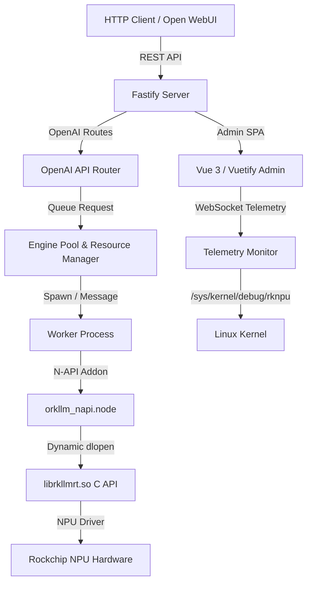

# oRKLLM

[](https://github.com/oRKLLM/oRKLLM/actions/workflows/ci.yml)
[](https://github.com/oRKLLM/oRKLLM/actions/workflows/release.yml)
[](https://github.com/oRKLLM/oRKLLM/releases/latest)
[](https://nodejs.org)
[](LICENSE)
[](https://github.com/oRKLLM/oRKLLM)
[](https://github.com/oRKLLM/oRKLLM/actions/workflows/ci.yml)
[](https://github.com/oRKLLM/oRKLLM/security/code-scanning)

```
              )       (
             ( \     / )          ██████╗ ██████╗ ██╗  ██╗██╗     ██╗     ███╗   ███╗
              \_\   /_/          ██╔═══██╗██╔══██╗██║ ██╔╝██║     ██║     ████╗ ████║
            .-----------.        ██║   ██║██████╔╝█████╔╝ ██║     ██║     ██╔████╔██║
           /  [*]   [*]  \       ██║   ██║██╔══██╗██╔═██╗ ██║     ██║     ██║╚██╔╝██║
          |    \  ω  /    |      ╚██████╔╝██║  ██║██║  ██╗███████╗███████╗██║ ╚═╝ ██║
           \  .-------.  /        ╚═════╝ ╚═╝  ╚═╝╚═╝  ╚═╝╚══════╝╚══════╝╚═╝     ╚═╝
          _/\/  #####  \/\_
         /  /   #####   \  \      Pronounced "ORC-EL-EL-EM"
        / ,/    #####    \, \     OpenAI-compatible LLM inference for Rockchip NPU.
       | / |  .-------.  | \ |    No cloud. No nonsense. Just efficient NPU inference.
       |/  '--[=======]--'  \|
       |       |     |       |
        \   ,  |     |  ,   /
         \  \. |     | ./  /
          '--' |     | '--'
               |     |
              / \   / \
             '   '-'   '
```

> **Disclaimer:** oRKLLM is an independent, community-driven project. It is **not affiliated with, endorsed by, or supported by Rockchip Semiconductor Co., Ltd.** or any of its subsidiaries. "Rockchip", "RK3576", "RK3588", "RKLLM", and "RKNN" are trademarks of Rockchip Semiconductor Co., Ltd. The `librkllmrt.so` runtime library is developed and distributed by Rockchip/Airockchip under the Apache 2.0 License — oRKLLM uses it unmodified.

oRKLLM is an energy-efficient, OpenAI API-compatible local LLM inference server and premium admin console designed specifically for Rockchip NPU-powered platforms (such as the **RK3576** found in the NanoPi M5 and **RK3588** series SBCs).

Inspired by [jundot/oMLX](https://github.com/jundot/omlx) (which does the same for Apple Silicon), oRKLLM is adaptively re-engineered to run on the Rockchip RKLLM runtime (`librkllmrt.so`) with its unique hardware and concurrency constraints.

---

## 🚀 Key Features

* **OpenAI API Compatibility**: Drop-in `/v1/chat/completions`, `/v1/models`, and `/v1/embeddings` endpoints — works with Open WebUI, Claude Code, and any OpenAI-compatible client.
* **Full Admin Console**: Built with **Vue 3** and **Vuetify 3** — seven dedicated pages:
  * **Dashboard** — live CPU/NPU/GPU/RAM/Disk/Temperature/Fan/RAM-bandwidth gauges, serving stats, prefix cache observability, RKLLM runtime versions
  * **Models** — local model manager (sorted into servable `.rkllm` models, base models, and Eagle-3 draft heads), HuggingFace search, collection browser, direct downloader
  * **Settings** — inference defaults, HF token, prefix cache config, trusted proxy
  * **Logs** — full-page real-time log terminal over WebSocket
  * **Bench** — inference benchmark (TTFT, prefill tok/s, generation tok/s); completed runs are persisted and listed in a Previous Runs history table
  * **Chat** — full streaming chat UI with conversation history sidebar (grouped by model), message queueing during inference, system prompt, model selector, and parameter controls
  * **Help** — a Help &amp; Learning hub: quick-start guide, expandable explanations of core concepts (LLM fundamentals, running models efficiently, self-hosting on Rockchip, enterprise features, and cutting-edge research), curated external resources, and a searchable glossary of the whole oRKLLM ecosystem
* **Conversation History**: Chat sessions persisted in SQLite grouped by model. Collapsible sidebar on desktop, bottom-sheet on mobile. Partial responses saved via `sendBeacon` on page navigation.
* **Pin Model**: Pin the active model to prevent idle auto-unload. Pin state persists across server restarts and triggers automatic model load on startup when sufficient RAM is available.
* **Multi-User Auth & RBAC**: Local accounts or federated SSO via OIDC/SAML (Keycloak, Google, Azure AD). Two roles: `admin` and `user`. Site Management UI for user CRUD, auth provider config, and audit log.
* **OIDC / SAML SSO**: Standard Flow with PKCE for public clients (no secret required). Group-to-role mapping from IdP claims. Routes at `/auth/oidc/*` and `/auth/saml/*`.
* **HuggingFace Integration**: Search the HF Hub, browse collections, and download three kinds of model directly — servable `.rkllm` models, **base models** (safetensors), and **Eagle-3 draft heads**. Search results show parameter count and storage size. A **Compatible chipset** filter auto-detects your SoC (RK3576/RK3588) from the board's device tree and appends it to the query — preventing downloads of models built for the wrong platform. The Download button queues all repo files simultaneously (weights + the `.json` metadata base models and heads need) with per-file progress bars, speeds, and byte counters grouped by repo. Files saved to `models/{repoName}/`, then sorted into the three categories on the Models page by the files present and each repo's `config.json`.
* **Eagle-3 Speculative Decoding** *(Mali GPU)*: An optional `vulkan` draft strategy runs an [EAGLE-3](https://github.com/SafeAILab/EAGLE) draft head on the Mali GPU concurrently with NPU verification, using oRKLLM's own SPIR-V compute shaders (read straight from the head's `.safetensors` — no GGUF conversion). Because EAGLE-3 heads share the base model's token embeddings (and don't ship their own), the Models page lets you give a head its embeddings from an explicitly chosen base model — either a base model you've downloaded, or just the embedding slice (~778 MB) range-fetched from a base repo you specify. Falls back to standard generation when the GPU, head, or embeddings are unavailable.
* **Prefix KV Cache**: Tiered SSD hot/cold LRU cache saves KV state between conversation turns. Sliding context window (configurable up to 32,768 tokens, default 8,192) prevents NPU OOM on long conversations.
* **MCP Servers**: Connect [Model Context Protocol](https://modelcontextprotocol.io) servers from **Settings** — `stdio` (local command), `SSE`, and streamable `HTTP` transports, with an auth-type selector (none / Bearer token / API key header / Basic / custom headers) so credentials don't have to be hand-formatted. Add/edit/enable/test servers; a connection test lists each server's advertised tools. With **Use MCP tools in inference** enabled (a global setting), `/v1/chat/completions` runs a prompt-driven tool-use loop: the model's `<tool_call>` requests are executed against the MCP servers and the results fed back until it answers (models without native function-calling are supported via the prompt protocol). The **Chat** page has its own per-chat tool picker — flip **Use MCP tools** and check the individual tools to expose (Select all / Clear, in a scrollable list with the selection's token cost); those tools are sent with the request so the same execution loop runs scoped to your selection, no global setting required.
* **Process-Isolated Execution**: Inference engine runs in a dedicated child process. Model unload/swap terminates the process, guaranteeing full NPU driver memory cleanup.
* **Smart Resource Management**: Single active model lock, auto-swap, configurable idle timeout, pin-to-keep-loaded.
* **Runtime Version Auto-Matching & Auto-Download**: oRKLLM reads the embedded version from each `librkllmrt.so` (via `strings`), matches it against the version in the model filename, and retries all candidates until one succeeds — caching the winner per model. On first setup, opt in to automatically download all versioned runtimes from [oRKLLM/rkllm-runtimes](https://github.com/oRKLLM/rkllm-runtimes) (Apache 2.0). Opted-out users are prompted with a disclaimer dialog in the UI; API callers receive HTTP 422 `RUNTIME_MISSING` with the required version. Toggle in Settings after setup.
* **Dual-Runtime Support (GGUF + RKLLM)**: Serve both `.rkllm` models (Rockchip RKLLM closed runtime) and `.gguf` models (open llama.cpp-rockchip NPU runtime via `ggml-ork` backend) from the same server. The backend is selected automatically by file extension. The llama runtime bundle (`libllama.so` + ggml-ork libs) downloads on demand from `oRKLLM/llama.cpp-rockchip`. Models, library, and Dashboard all show a runtime chip (`rkllm` / `llama`).
* **APT Distribution Channels**: Three channels — `stable` (main), `beta`, `alpha` — with separate `dists/<channel>/` directories on gh-pages. Users pin to their preferred channel.
* **Trusted Proxy**: Supports `true`, single IP/CIDR, or comma-separated list (SAN-style) passed directly to Fastify's `trustProxy`.
* **Database Migrations**: PRAGMA user_version migration runner — schema changes (v1–v5) apply automatically on startup, safe across upgrades from any previous version.
* **Installable PWA**: The admin/chat console is a Progressive Web App — install it to your phone or desktop (manifest + icons), with the app shell cached by a service worker for instant loads and a graceful offline state. Live data (inference, metrics) stays network-only; new versions auto-update. Requires a secure context (HTTPS or `localhost`) to install.
* **Remote Access via Tailscale** *(optional)*: From **Site Management → Remote Access**, paste a [Tailscale auth key](https://login.tailscale.com/admin/settings/keys) to join your tailnet headlessly and start `tailscale serve` — exposing oRKLLM over HTTPS at its `https://<machine>.<tailnet>.ts.net` URL (with QR code for phone install). One canonical origin works at LAN speed when home and over Tailscale when away; only devices on your tailnet can connect (never the public internet). Tailscale is **runtime-detected, not an install dependency** — install it on the server first (it's not in stock Debian repos; see [tailscale.com/download](https://tailscale.com/download/linux)) and enable MagicDNS + HTTPS certificates in your tailnet admin.
* **Seamless Mock Fallback**: On non-ARM64/non-Linux platforms, oRKLLM falls back to a JS mock engine — rapid UI development on macOS/Windows without a board.
* **Dynamic N-API Bindings**: C++ addon uses `dlopen`/`dlsym` — no compile-time dependency on `librkllmrt.so`.
* **Secure Auth**: PBKDF2-HMAC-SHA256 password hashing, signed session cookies (`userId|username|role|expires|HMAC`), backward-compatible with single-user installs.

---

## 🛠️ Architecture & Tech Stack



| Layer | Technology |
| :--- | :--- |
| **API Server** | Node.js + Fastify (ES Modules) |
| **Native Bindings** | C++ N-API addon (`node-addon-api`) with `dlopen`/`dlsym` |
| **Mock Fallback** | Pure JS mock engine (auto-enabled on non-ARM64/non-Linux) |
| **Frontend** | Vue 3 + Vuetify 3 SPA, built with Vite, route-based code splitting |
| **Database** | SQLite via `node:sqlite` (Node ≥22.5) or `node-sqlite3-wasm` (Node <22.5) |
| **Auth** | Local PBKDF2 + OIDC (PKCE) + SAML 2.0 |
| **Testing** | Playwright E2E (81 tests across 3 spec files) + node:test unit tests, mock OIDC service container in CI |

---

## 📦 Installing from a Release Package (Ubuntu / Armbian ARM64)

Pre-built `.deb` packages for ARM64 are available via the oRKLLM APT repository or directly from the [GitHub Releases page](https://github.com/oRKLLM/oRKLLM/releases).

### Option A — APT repository (recommended)

Three channels are available:

| Channel | Branch | Description |
| :--- | :--- | :--- |
| `stable` | `main` | Production releases — recommended for most users |
| `beta` | `beta` | Release candidates promoted from alpha after 48 h with no bug reports |
| `alpha` | `alpha` | Cutting-edge development builds |

```bash
# Trust the oRKLLM signing key
curl -fsSL https://oRKLLM.github.io/oRKLLM/orkllm.gpg \
  | sudo gpg --dearmor -o /usr/share/keyrings/orkllm.gpg

# Add the repository — replace 'stable' with 'beta' or 'alpha' to follow pre-releases
echo "deb [arch=arm64 signed-by=/usr/share/keyrings/orkllm.gpg] \
  https://oRKLLM.github.io/oRKLLM stable main" \
  | sudo tee /etc/apt/sources.list.d/orkllm.list

sudo apt update && sudo apt install orkllm
```

### Option B — Direct download

```bash
VERSION=0.7.0
wget https://github.com/oRKLLM/oRKLLM/releases/latest/download/orkllm_${VERSION}_arm64.deb
sudo dpkg -i orkllm_${VERSION}_arm64.deb
```

### Configure

```bash
sudo nano /etc/orkllm/orkllm.conf
```

```bash
ORKLLM_HOST=0.0.0.0
ORKLLM_PORT=8000
ORKLLM_LIB_PATH=/usr/lib/librkllmrt.so
ORKLLM_MODELS_DIR=/var/lib/orkllm/models
ORKLLM_DB_PATH=/var/lib/orkllm/orkllm.db
```

### Add models and start

```bash
sudo cp your_model.rkllm /var/lib/orkllm/models/
sudo systemctl start orkllm
```

Admin console: `http://<device-ip>:8000/admin`

### Service management

```bash
sudo systemctl start|stop|restart|status orkllm
journalctl -u orkllm -f
```

---

## ⚙️ Installation from Source

### Prerequisites

- Node.js ≥ 18 (≥ 22.5 preferred for native `node:sqlite`)
- `node-gyp` dependencies: Python 3, C++ compiler (Xcode CLT on macOS, `build-essential` on Linux)
- *(optional, ARM64 Linux)* `libvulkan-dev` at build time for the GPU-accelerated paths (KV-cache quantisation and the Eagle-3 Mali draft head); at runtime `libvulkan1` + `mesa-vulkan-drivers` provide the loader and the Mali driver across chipsets (Mali-G52 on RK3576, Mali-G610 on RK3588). The `.deb` package declares these as dependencies; without Vulkan, oRKLLM falls back to NEON/CPU.
- A compiled `.rkllm` model (use `rkllm-toolkit` to convert from HuggingFace)
- `librkllmrt.so` on the target board (typically at `/usr/lib/librkllmrt.so`)

### Setup & Run

```bash
# Install all dependencies (compiles native addon)
npm install

# Build Vue frontend
npm run build:frontend

# Start development server (mock engine auto-enabled on macOS)
npm run dev:server
# → http://localhost:8000/admin
```

### Environment Variables

| Variable | Default | Description |
| :--- | :--- | :--- |
| `ORKLLM_HOST` | `127.0.0.1` | Listen address (`0.0.0.0` for LAN) |
| `ORKLLM_PORT` | `8000` | Listen port |
| `ORKLLM_LIB_PATH` | `/usr/lib/librkllmrt.so` | Path to Rockchip RKLLM runtime |
| `ORKLLM_MODELS_DIR` | `./models` | Directory scanned for `.rkllm` files |
| `ORKLLM_DB_PATH` | `~/.config/orkllm/auth.db` | SQLite database path |
| `ORKLLM_TRUSTED_PROXY` | *(unset)* | `true` (all), a single IP/CIDR, or comma-separated IPs/CIDRs to trust `X-Forwarded-*` headers |
| `ORKLLM_RUNTIMES_DIR` | `~/.config/orkllm/runtimes` | Directory of versioned `librkllmrt-aarch64-vX.Y.Z.so` files for automatic runtime matching |
| `ORKLLM_RUNTIME_MIRRORS` | `oRKLLM/rkllm-runtimes,mafischer/rkllm-runtimes` | Comma-separated list of GitHub repo slugs tried in order when downloading runtime `.so` files — first mirror that has the version wins |
| `ORKLLM_SPV_DIR` | `~/.config/orkllm/spv` | Directory for the extracted Vulkan SPIR-V shaders (Eagle-3 GPU draft); exposed to the native Vulkan loader |
| `ORKLLM_SPV_MIRRORS` | `oRKLLM/llama.cpp` | Comma-separated GitHub repo slugs for the prebuilt `ggml-vulkan-spirv-<tag>.tar.gz` shader releases |
| `ORKLLM_LLAMA_RUNTIME_DIR` | `~/.config/orkllm/llama-runtime` | Directory for the `libllama.so` + ggml-ork bundle (llama/GGUF backend) |
| `ORKLLM_LLAMA_RUNTIME_MIRRORS` | `oRKLLM/llama.cpp-rockchip` | Comma-separated GitHub repo slugs for downloading the llama runtime bundle |

---

## 🧪 Running Tests

```bash
# Full E2E suite (mock mode, no board required)
npm test

# SSO integration tests using local Keycloak container (same as CI)
npm run test:sso        # starts Keycloak + runs SSO tests
npm run test:sso:down   # tear down Keycloak when done
```

CI runs the full suite including OIDC SSO via a containerised Keycloak instance with a pre-configured `orkllm` realm.

### Test environment variables

Set these in `.env` locally (gitignored) or as GitHub Actions secrets/variables. The `.env` file is loaded automatically by Playwright.

| Variable | Where | Description |
| :--- | :--- | :--- |
| `ORKLLM_TEST_ADMIN_USER` | Secret | Admin username created during test setup |
| `ORKLLM_TEST_ADMIN_PASS` | Secret | Admin password |
| `ORKLLM_TEST_OIDC_ISSUER` | Secret | Real Keycloak issuer URL (for `ORKLLM_TEST_LIVE=1`) |
| `ORKLLM_TEST_OIDC_CLIENT_ID` | Secret | OIDC client ID (`orkllm-oidc`) |
| `ORKLLM_TEST_SAML_METADATA_URL` | Secret | Real Keycloak SAML metadata URL |
| `ORKLLM_TEST_OIDC_USER` | Secret | Keycloak test user (`testuser`) |
| `ORKLLM_TEST_OIDC_USER_PASS` | Secret | Keycloak test user password |
| `ORKLLM_TEST_OIDC_ADMIN_USER` | Secret | Keycloak admin test user (`testadminuser`) |
| `ORKLLM_TEST_OIDC_ADMIN_PASS` | Secret | Keycloak admin test user password |
| `ORKLLM_TEST_MOCK_OIDC_URL` | Auto-set | Issuer URL of CI Keycloak container (`http://localhost:8080/realms/orkllm`) |
| `ORKLLM_TEST_REDIRECT_BASE` | Auto-set | Base URL for OIDC `redirect_uri` — derived from this so protocol is correct (`http://` in CI, `https://` live) |
| `ORKLLM_TEST_LIVE` | Variable | Set to `1` to run SSO tests against real Keycloak on LAN |
| `ORKLLM_TEST_LIVE_URL` | Variable | Live server URL (e.g. `https://orkllm.fischerapps.com`) |

### Debugging failed CI tests

When E2E tests fail in CI, Playwright uploads screenshots and error context as an artifact named `playwright-report` (retained 7 days).

**Download via CLI:**
```bash
gh run download <run-id> --name playwright-report -D /tmp/report
# Find the run ID with: gh run list --limit 5
```

**Download via browser:** GitHub Actions run → **Summary** → **Artifacts** section at the bottom → download `playwright-report.zip`.

Each failed test has a `test-failed-1.png` screenshot and an `error-context.md` with the stack trace, making it easy to see exactly what the browser showed at the point of failure.

---

## ⚙️ RKLLM Runtime Auto-Downloader

oRKLLM requires a versioned copy of Rockchip's `librkllmrt.so` runtime library to drive NPU inference. Each `.rkllm` model file is compiled against a specific runtime version (e.g. `1.2.3`), and loading a model with the wrong version fails immediately.

### How it works

1. oRKLLM parses the runtime version from the model filename (e.g. `Qwen3-8B-rk3576-w4a16-**1.2.3**.rkllm`).
2. It searches `ORKLLM_RUNTIMES_DIR` (`~/.config/orkllm/runtimes/` by default) for a matching `librkllmrt-aarch64-v1.2.3.so`.
3. If none matches, it retries with all other available runtimes newest-first, then falls back to the system `/usr/lib/librkllmrt.so`.
4. The winning library is cached per model so future loads skip straight to it.

### Auto-download (opt-in)

During first-time setup you are prompted to opt in to **auto-downloading runtimes**. When enabled:

- All available runtime versions are downloaded in the background at server startup.
- When a model is loaded whose required runtime is not yet present, oRKLLM downloads it automatically before retrying the load.
- The toggle can be changed at any time in **Settings → Runtime Auto-Download**.

When opted out, the UI shows a disclaimer dialog before downloading, and API callers receive `HTTP 422 RUNTIME_MISSING` with the required version.

### Runtime mirror

Pre-built `librkllmrt.so` binaries for `aarch64` and `armhf` are published at:

**[github.com/oRKLLM/rkllm-runtimes](https://github.com/oRKLLM/rkllm-runtimes)**

The mirror syncs from [airockchip/rknn-llm](https://github.com/airockchip/rknn-llm) nightly. All versions from v1.0.1 onward are available.

#### Direct download

```bash
VERSION=v1.2.3
ARCH=aarch64   # or armhf

curl -fsSL \
  https://github.com/oRKLLM/rkllm-runtimes/releases/download/${VERSION}/librkllmrt-${ARCH}-${VERSION}.so \
  -o ~/.config/orkllm/runtimes/librkllmrt-${ARCH}-${VERSION}.so
```

### Licensing

`librkllmrt.so` is Rockchip proprietary software distributed by Airockchip under the **[Apache 2.0 License](https://github.com/airockchip/rknn-llm/blob/main/LICENSE)** as part of the [rknn-llm](https://github.com/airockchip/rknn-llm) repository. The Apache 2.0 license explicitly permits redistribution with attribution. The mirror at `oRKLLM/rkllm-runtimes` reproduces this license in full on every release.

> **oRKLLM does not modify the binaries.** They are downloaded verbatim from the upstream repository and re-published as properly versioned GitHub release artifacts for programmatic access.

---

## 📐 Model Naming Convention

To help establish consistency across the fragmented Rockchip community, oRKLLM adopts a single unified naming convention for both the HuggingFace repository and the `.rkllm` file inside it.

### Unified format

```
{Family}-{Params}-{Variant}-{Chipset}-{Quant}-{Algo}-v{Version}-RKLLM.rkllm
```

The HuggingFace repository name is the same string without the `.rkllm` extension.

**Example:** `Qwen3-4B-Base-rk3576-w4a16-grq-v1.2.3-RKLLM`  
**File inside repo:** `Qwen3-4B-Base-rk3576-w4a16-grq-v1.2.3-RKLLM.rkllm`

| Field | Description | Example |
| :---- | :---------- | :------ |
| `Family` | Base model name | `Qwen3`, `Llama3`, `Gemma2` |
| `Params` | Parameter count | `4B`, `8B`, `0.5B`, `35BA3B` |
| `Variant` | Model variant | `Base`, `Instruct`, `Chat` |
| `Chipset` | Target Rockchip SoC | `rk3576`, `rk3588` |
| `Quant` | Quantization type | `w4a16`, `w8a8` |
| `Algo` | Quantization algorithm | `grq`, `awq`, `gptq` |
| `Version` | rkllm-toolkit version (with `v` prefix) | `v1.2.3` |
| `RKLLM` | Required suffix for HuggingFace discoverability | — |

> **Note:** oRKLLM parses the runtime version from the `v{Version}` field in the filename to auto-select the correct `librkllmrt.so`. Always include the version. Legacy files without the `v` prefix and `-RKLLM` suffix are also supported.

### Recommended HuggingFace tags

Including these tags maximises discoverability and enables oRKLLM's compatible-chipset search filter to surface your model:

| Category | Tags |
| :------- | :--- |
| **Core** | `rkllm`, `rockchip`, `npu` |
| **Chipset** | `rk3576`, `rk3588` *(add whichever applies)* |
| **Model family** | `qwen3`, `llama`, `gemma` *(lowercase)* |
| **Format** | `rkllm`, `rknn` |

---

## 🌿 Contributing & Branch Flow

All development happens on the `alpha` branch. Promotions flow strictly forward — **never commit directly to `beta` or `main`.**

```
alpha  →  beta  →  main
```

| Action | Command |
| :----- | :------ |
| Promote to beta | `git push origin alpha:beta` |
| Promote to main (stable release) | `git push origin beta:main` |

These are fast-forward pushes — no checkout, no merge commit. `beta` is a 48-hour soak channel; if no bugs are filed it can be promoted to `main`. Never use `--no-ff` for promotions as it creates merge commits that break future fast-forwards.

---

## 🤝 Credits & Acknowledgements

* **[jundot/oMLX](https://github.com/jundot/omlx)**: Inspired the dashboard layout, metrics design, single-model lifecycle, and OpenAI compatibility structures.
* **Rockchip**: SDKs and runtime libraries (`librkllmrt.so`) powering localized NPU inference.
* **[SafeAILab/EAGLE](https://github.com/SafeAILab/EAGLE)** & **[Tencent/AngelSlim](https://github.com/Tencent/AngelSlim)**: the EAGLE-3 speculative-decoding method and the open draft-head weights that oRKLLM's `vulkan` draft strategy serves. oRKLLM implements the draft forward pass from scratch in its own SPIR-V compute shaders.
* **[ggml-org/llama.cpp](https://github.com/ggml-org/llama.cpp)** (MIT): oRKLLM retains an optional fetcher (`spv_sync.js`, `ORKLLM_SPV_*`) for the project's prebuilt `ggml-vulkan` SPIR-V shaders. This path is no longer on the Eagle-3 critical path (the native shaders above replaced it) but remains available; full credit to the llama.cpp / ggml authors, whose license is shown and must be accepted before download.
