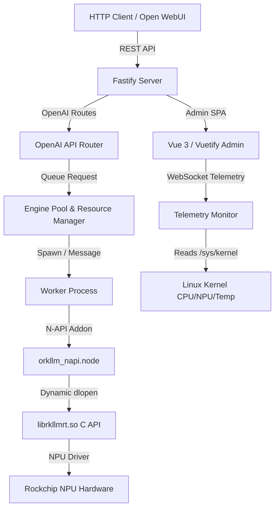

# oRKLLM

```
              )       (
             ( \     / )          ██████╗ ██████╗ ██╗  ██╗██╗     ██╗     ███╗   ███╗
              \_\   /_/          ██╔═══██╗██╔══██╗██║ ██╔╝██║     ██║     ████╗ ████║
            .-----------.        ██║   ██║██████╔╝█████╔╝ ██║     ██║     ██╔████╔██║
           /  [*]   [*]  \       ██║   ██║██╔══██╗██╔═██╗ ██║     ██║     ██║╚██╔╝██║
          |    \  ω  /    |      ╚██████╔╝██║  ██║██║  ██╗███████╗███████╗██║ ╚═╝ ██║
           \  .-------.  /        ╚═════╝ ╚═╝  ╚═╝╚═╝  ╚═╝╚══════╝╚══════╝╚═╝     ╚═╝
          _/\/  #####  \/\_
         /  /   #####   \  \      Pronounced "ORC-EL-EL-EM"
        / ,/    #####    \, \     OpenAI-compatible LLM inference for Rockchip NPU.
       | / |  .-------.  | \ |    No cloud. No nonsense. Just raw NPU inference.
       |/  '--[=======]--'  \|
       |       |     |       |
        \   ,  |     |  ,   /
         \  \. |     | ./  /
          '--' |     | '--'
               |     |
              / \   / \
             '   '-'   '
```

oRKLLM is a high-performance, OpenAI API-compatible local LLM inference server and premium admin console designed specifically for Rockchip NPU-powered platforms (such as the **RK3576** found in the NanoPi M5 and **RK3588** series SBCs). 

This project draws key design patterns and architectural inspiration from the [judot/omlx](https://github.com/jundot/omlx) (also known as `jundot/omlx`) repository (originally designed for Apple Silicon / MLX), adaptively re-engineered to run on the Rockchip NPU runtime (`librkllmrt.so`) with its unique hardware and concurrency constraints.

---

## 🚀 Key Features

* **OpenAI API Compatibility**: Exposes standard `/v1/chat/completions`, `/v1/models`, and `/v1/embeddings` endpoints.
* **Full Admin Console**: Built with **Vue 3** and **Vuetify 3** — six dedicated pages accessible from a persistent navbar:
  * **Dashboard** — live telemetry gauges (CPU/NPU/RAM/Temperature), serving stats, inference playground
  * **Models** — local model manager, HuggingFace search, collection browser, and model downloader
  * **Settings** — global inference defaults, HuggingFace API token, password management
  * **Logs** — full-page real-time log terminal over WebSocket
  * **Bench** — inference benchmark measuring TTFT, prefill tok/s, and generation tok/s
  * **Chat** — full streaming chat UI with system prompt, model selector, and parameter controls
* **HuggingFace Integration**: Search the HF Hub, browse collections (e.g. `huggingface.co/collections/Qwen/qwen3-...`), and download `.rkllm` models directly from the admin console. HF token stored in settings for gated/private repos.
* **Process-Isolated Execution**: Launches the inference engine inside a dedicated Node.js child process (`worker.js`). If a model is unloaded or swapped, the child process is terminated, ensuring 100% cleanup of NPU driver memory to prevent driver OOM crashes.
* **Smart Resource Management**:
  * **Single Active Model Lock**: Ensures only one model is active in NPU memory at a time.
  * **Auto-Swapping**: Automatically unloads the current model and loads the requested one when a new inference request arrives.
  * **Idle Timeout**: Automatically unloads models after a configurable period of inactivity.
* **Seamless Mock Fallback**: If run on non-Linux or non-ARM64 platforms, or if `librkllmrt.so` is missing, oRKLLM transparently falls back to a Javascript-based mock engine. This enables rapid frontend and integration development on macOS, Windows, and x86 Linux.
* **Dynamic N-API Bindings**: Built using C++ N-API (`node-addon-api`) with dynamic loading (`dlopen`/`dlsym`). The native addon compiles on any environment without compile-time link-dependencies on the RKLLM shared library.
* **Secure First-Launch Flow**: Forces setup of credentials on first launch. Subsequent requests require cookie-based session verification. Password hashes are generated using `PBKDF2-HMAC-SHA256`.

---

## 🛠️ Architecture & Tech Stack



* **Backend**: Node.js + Fastify (ES Modules)
* **Native Bindings**: Node-API (C++)
* **Frontend**: Vue 3 + Vuetify 3 (Vite, SPA, offline-first)
* **Database/Auth Storage**: Local JSON file (`.orkllm_auth.json` or custom path)
* **Testing**: Playwright (E2E browser tests)

---

## 📦 Directory Structure

```text
oRKLLM/
├── README.md               # This documentation
├── GEMINI.md               # Original architectural constraints & design
├── package.json            # Node workspace packages, dependencies & scripts
├── binding.gyp             # node-gyp configuration for C++ N-API compilation
├── playwright.config.js    # Playwright configuration
├── models/                 # Directory to place compiled .rkllm files
├── src/                    # Backend Source Files
│   ├── addon/
│   │   └── orkllm_napi.cpp # C++ wrapper mapping C functions to JS
│   ├── api/
│   │   └── routes.js       # OpenAI compatible endpoints (/v1/...)
│   ├── admin/
│   │   └── routes.js       # SPA serving, login & setup actions, WebSocket server
│   ├── config.js           # Server configuration & PBKDF2 cryptography
│   ├── mock_engine.js      # JS-based simulated LLM engine fallback
│   ├── monitor.js          # Linux system performance sensor parser
│   ├── pool.js             # Serialized loader & idle timer manager
│   ├── worker.js           # Subprocess wrapper containing engine instance
│   └── server.js           # Fastify application bootstrap & log interceptors
├── frontend/               # SPA Vue 3 / Vuetify code
│   ├── package.json        
│   ├── vite.config.js      
│   ├── index.html          
│   └── src/                # Front-end components, router & styles
└── e2e/                    # Playwright test files
    └── orkllm.spec.js      # Integrated full-journey E2E test
```

---

## 📦 Installing from a Release Package (Ubuntu / Armbian)

Pre-built `.deb` packages for ARM64 are available via the oRKLLM APT repository or directly from the [GitHub Releases page](https://github.com/mafischer/oRKLLM/releases).

### Option A — APT repository (recommended)

Add the repository once; future releases install with `apt upgrade`:

```bash
# Trust the oRKLLM signing key
curl -fsSL https://mafischer.github.io/oRKLLM/orkllm.gpg \
  | sudo gpg --dearmor -o /usr/share/keyrings/orkllm.gpg

# Add the repository
echo "deb [arch=arm64 signed-by=/usr/share/keyrings/orkllm.gpg] \
  https://mafischer.github.io/oRKLLM stable main" \
  | sudo tee /etc/apt/sources.list.d/orkllm.list

# Install
sudo apt update && sudo apt install orkllm
```

### Option B — Direct download

```bash
# Download the latest release (replace VERSION)
wget https://github.com/mafischer/oRKLLM/releases/latest/download/orkllm_VERSION_arm64.deb

# Install
sudo dpkg -i orkllm_VERSION_arm64.deb
```

### 2. Configure

Edit the config file to set the path to your `librkllmrt.so`:

```bash
sudo nano /etc/orkllm/orkllm.conf
```

Key settings:
```bash
ORKLLM_HOST=0.0.0.0          # Accept network connections
ORKLLM_PORT=8000
ORKLLM_LIB_PATH=/usr/lib/librkllmrt.so   # Path to Rockchip RKLLM runtime
```

### 3. Add models

Place compiled `.rkllm` model files in the models directory:

```bash
sudo cp your_model.rkllm /var/lib/orkllm/models/
```

### 4. Start the service

```bash
sudo systemctl start orkllm
```

The admin console will be available at `http://<device-ip>:8000/admin`.

### Managing the service

```bash
sudo systemctl start orkllm       # Start
sudo systemctl stop orkllm        # Stop
sudo systemctl restart orkllm     # Restart
sudo systemctl status orkllm      # Check status
journalctl -u orkllm -f           # Stream live logs
```

---

## ⚙️ Installation & Setup (from source)

### Prerequisites
* **Node.js** v18+ (tested on Node 20/22)
* **Build tools** (e.g., `make`, `g++`, `gcc` or Xcode Command Line Tools) for compiling the C++ addon
* **Rockchip NPU Runtime** (For target board execution):
  * A compiled `.rkllm` model (quantized using the `rkllm-toolkit` to 4-bit `w4a16` or 8-bit `w8a8`)
  * The NPU driver library `librkllmrt.so` located on the board (typically at `/usr/lib/librkllmrt.so`)

### 1. Install Dependencies
In the root directory, install all Node packages:
```bash
npm install
```
*Note: During installation, the native C++ addon (`orkllm_napi`) compiles automatically using `node-gyp`. If a compiler is missing or if it fails, the server will log the error and fall back cleanly to Mock Mode at runtime.*

### 2. Build the Admin Frontend
To build and bundle the Vue 3 application into optimized static assets:
```bash
npm run build:frontend
```

### 3. Place Models
Create a `models/` directory in the root and place your `.rkllm` files inside it:
```bash
mkdir -p models
# Place compiled .rkllm files here
```

---

## 🏃 Running the Server

### Development Mode (Mock Mode / Automatic Reload)
Runs the server locally on port `8000`. By default, on macOS/Windows/x86 Linux it runs using the Mock Engine:
```bash
npm run dev:server
```

To run the Vue frontend separately with hot-reloading (proxied to Fastify):
```bash
npm run dev:frontend
```

### Production Mode
Runs the built server. It will serve the frontend statically from `/admin`:
```bash
npm start
```

### Custom Configuration
You can customize the server by defining the following environment variables:
* `ORKLLM_PORT`: Port to listen on (Default: `8000`)
* `ORKLLM_HOST`: Host to bind to (Default: `127.0.0.1` locally, or `0.0.0.0` for network exposure)
* `ORKLLM_MODELS_DIR`: Directory containing `.rkllm` models (Default: `./models`)
* `ORKLLM_AUTH_FILE`: Path to write the credentials JSON file (Default: `~/.orkllm_auth.json`)
* `ORKLLM_LIB_PATH`: Path to the `librkllmrt.so` shared library (Default: `/usr/lib/librkllmrt.so` or customized location)

Example running on the NanoPi M5:
```bash
ORKLLM_HOST=0.0.0.0 ORKLLM_PORT=8000 ORKLLM_LIB_PATH=/usr/lib/librkllmrt.so npm start
```

---

## 🧪 Running End-to-End Tests

The repository includes a comprehensive Playwright E2E suite verifying the full user journey: first-launch setup, session login/logout, WebSocket telemetry dashboard updates, model scanning, model loading/unloading, streaming chat completions, and log viewer integration.

To run the E2E tests:
```bash
npm run test:e2e
```
*Note: Playwright will automatically start a sandboxed instance of the Fastify server in Mock Mode on port `8000` (pointing to a temporary `.orkllm_auth.json`), run the tests, and tear it down upon completion.*

---

## 🤝 Credits & Acknowledgements

* **[judot/omlx](https://github.com/jundot/omlx)**: Inspired the dashboard layout, metrics design, single-model lifecycle concepts, and OpenAI compatibility structures.
* **Rockchip**: SDKs and runtime libraries (`librkllmrt.so`) powering localized NPU inference.
